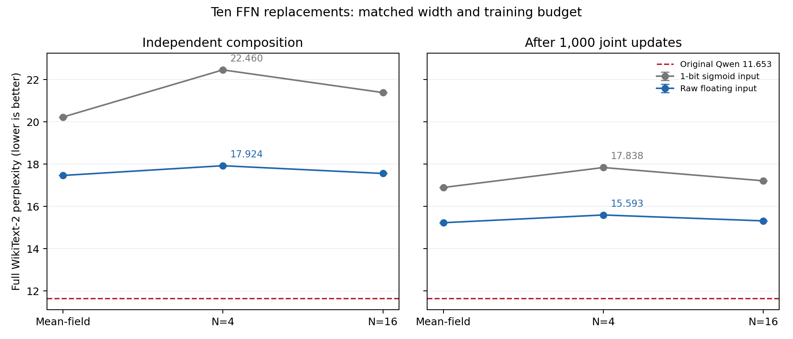

# 十层原始浮点入口与单比特入口对照（2026-10-01）

在 Qwen2.5-0.5B Base 同时替换 `{7,8,9,10,11,12,13,14,15,18}` 十个 FFN。
实验组直接使用原始浮点输入，不量化、不裁剪、不先过 sigmoid。每个 FFN 为
`x → W₁x+b₁ → Bernoulli(sigmoid(h/T)) → W₂z+b₂`。隐藏层仍为 0/1，
每条完整路径只在输出之后平均。浮点计算沿用 BF16 激活/混合精度，训练权重为 FP32。

## 公平对照与训练协议

两组的全部十个局部模型均从头训练：宽度4864，seed0，共同矩阵初始化和训练窗口，
2000步 mean-field + 6000步 N=4，每步1024 token。输入采样使两组随机流不同。
对照组为原 sigmoid 单比特入口，入口温度初值0.125；两组隐藏温度初值0.5。
温度可学习，矩阵偏置保留，无额外 p-bit 阈值。随后各做1000步 N=4 联合蒸馏，
损失为0.8 teacher-logit KL + 0.2 next-token CE，学习率1e-5。原 Qwen 其余参数冻结。
历史十层18.568570使用2000步采样训练及不同编码设置，因此仅作为历史参考，
不能用它与新结果的全部差距归因于入口改动。

## 完整 WikiText-2 结果

原始 Qwen PPL：**11.652735**。上下文2048，步长1024，299078个test token，计分299077个。
N=4为三个推理种子的均值与总体标准差；不是训练种子的置信区间。

| 入口 | 阶段 | Mean-field | N=4 | N=16 |
| --- | --- | ---: | ---: | ---: |
| 单比特 sigmoid 入口 | 独立组合 | 20.227139 | 22.459804 ± 0.005172 | 21.385855 |
| 单比特 sigmoid 入口 | 联合训练 | 16.893216 | 17.838368 ± 0.002506 | 17.210035 |
| 原始浮点入口 | 独立组合 | 17.463193 | 17.923949 ± 0.010939 | 17.556719 |
| 原始浮点入口 | 联合训练 | 15.226126 | 15.592537 ± 0.009335 | 15.312789 |

独立组合：浮点入口相对匹配单比特对照降低 4.535855 PPL
（20.20%），消除了相对原Qwen超额NLL的
34.38%；浮点入口PPL仍比原Qwen高
53.82%。

联合训练：浮点入口相对匹配单比特对照降低 2.245831 PPL
（12.59%），消除了相对原Qwen超额NLL的
31.60%；浮点入口PPL仍比原Qwen高
33.81%。

## 实验判断

取消入口二值化带来明确改善，但本轮十层替换没有达到接近原模型的质量。
同预算对照说明入口表示确实是一个瓶颈；同时，浮点入口的mean-field结果
仍明显差于原始Qwen，提示剩余的确定性映射逼近、训练目标和多层分布偏移
需要继续研究。不能据此认定该结构存在不可突破的理论上限。

下一步比继续增加入口编码位数更有针对性的对照是：保持浮点入口，比较现有
两矩阵sigmoid隐藏结构与保留SwiGLU幅值/乘积结构的学生；并用中间状态
匹配检验误差累积。增加采样数仍可减少方差，但本轮N=16并未接近原模型。

## 单层诊断

每次只替换一层，均为推理seed0。

| 层 | sigmoid MF | 浮点 MF | sigmoid N=4 | 浮点 N=4 |
| ---: | ---: | ---: | ---: | ---: |
| 7 | 12.203148 | 12.052922 | 12.311054 | 12.092776 |
| 8 | 12.189038 | 11.995445 | 12.226984 | 12.023089 |
| 9 | 12.037856 | 11.932238 | 12.101565 | 11.954890 |
| 10 | 11.955922 | 11.890664 | 12.000447 | 11.906100 |
| 11 | 12.001697 | 11.927574 | 12.057964 | 11.946102 |
| 12 | 12.002341 | 11.931872 | 12.045059 | 11.953123 |
| 13 | 12.019731 | 11.941571 | 12.082152 | 11.968233 |
| 14 | 12.035030 | 11.943753 | 12.095791 | 11.969158 |
| 15 | 12.243478 | 12.114517 | 12.340845 | 12.156931 |
| 18 | 12.235966 | 12.138468 | 12.297882 | 12.170605 |

## 成本与解释范围

| 入口 | 最佳联合步数 | 联合时间（秒） | 峰值已分配显存（GiB） |
| --- | ---: | ---: | ---: |
| 单比特 sigmoid 入口 | 1000 | 335.32 | 4.71 |
| 原始浮点入口 | 900 | 289.04 | 4.65 |

原始浮点入口组的单个 FFN，在固定输入下只含一个随机隐藏层及线性读出，
其条件期望在实数算术下等于 mean-field 输出；BF16 累加会另有舍入误差。
但十个随机 FFN 之间有注意力和其他非线性，整个模型的 mean-field PPL 并非
完整随机模型 N→∞ 的严格期望，也不是无条件的理论性能上界。

浮点入口取消了全二值矩阵输入约束，第一矩阵需要处理连续幅值，第二矩阵仍只接收0/1。
训练和测试时间是GPU模拟成本，不能据此推断专用p-bit硬件能耗。两个矩阵的形状
保持896→4864→896，每个浮点入口学生少一个输入温度标量。

仅一个训练seed、一个语言建模语料；结果不等于通用任务能力已恢复。模型选择使用
末65536个训练token保留集；test只在固定训练协议后评估。完整权重保留远程，
本目录保存协议、逐项PPL、训练记录、源码哈希和检查点身份。
