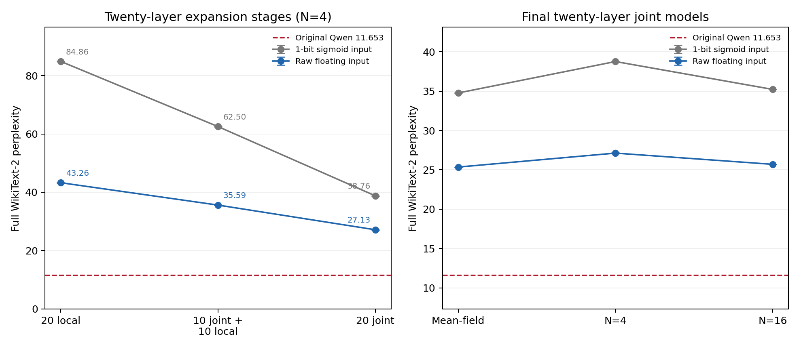
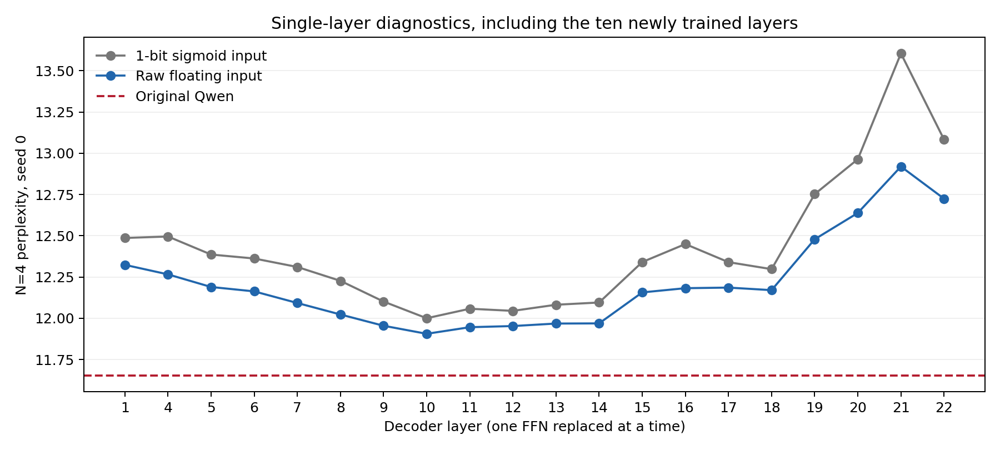
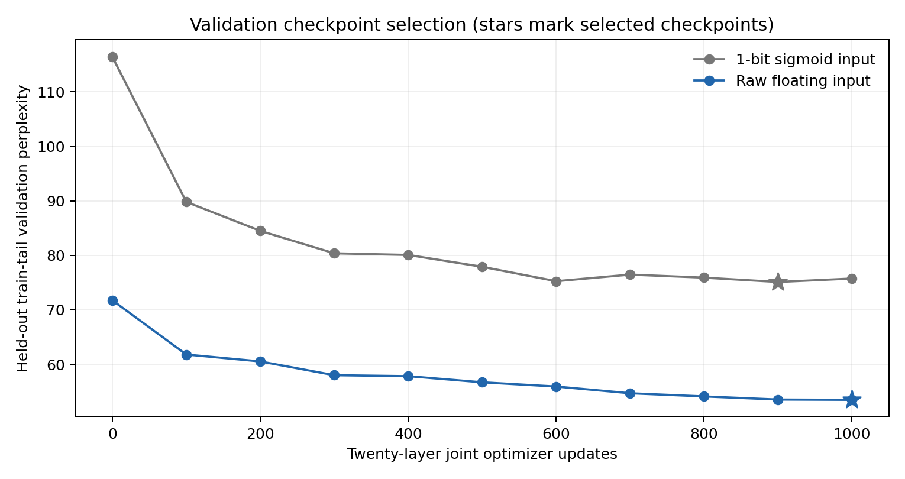

# 二十层直接浮点入口扩展实验（2026-10-01）

## 结构与训练协议

保留第0、2、3、23层原始Qwen FFN；替换层为

`{1,4,5,6,7,8,9,10,11,12,13,14,15,16,17,18,19,20,21,22}`。

浮点入口结构：`x → W₁x+b₁ → Bernoulli(sigmoid(h/T)) → W₂z+b₂`，
宽度4864，不裁剪、不量化入口，隐藏层仍为0/1。全部矩阵偏置保留，只有隐藏
温度可学习，无额外p-bit阈值。对照组在入口增加可学习温度的sigmoid二值采样。
两组沿用BF16激活及FP32可训练参数。每FFN只在最终输出处平均N条路径。

新增十层各自训练2000步mean-field加6000步N=4；此前十层独立检查点直接复用，
由SHA256核对。先评估20层全独立组合，再换入此前十层联合模型形成分阶段初始化，
最后从该初始化联合训练全部20个FFN共1000步。N=4，每步1024 token，学习率1e-5，
损失0.8 teacher-logit KL + 0.2 next-token CE。其余原模型参数冻结。

两种入口使用相同训练日程和验证选择规则；继承的十层最佳联合点分别为浮点900步、
sigmoid 1000步。二十层结果包含此前十层的联合适配，不能当作20层完全从头联合训练。
历史43.383146采用更短局部采样训练及不同阈值/温度设置，只作历史参考。

## 完整 WikiText-2 PPL

原始Qwen：**11.652735**。299078个test token，计分299077个，
上下文2048、步长1024。N=4报告推理seed0/1/2的均值和总体标准差；训练只有seed0。

| 阶段 | 入口 | Mean-field | N=4 | N=16 |
| --- | --- | ---: | ---: | ---: |
| 20层独立组合 | 单比特 sigmoid 入口 | 69.086356 | 84.856832 ± 0.035609 | 76.479234 |
| 20层独立组合 | 原始浮点入口 | 40.654725 | 43.260508 ± 0.034827 | 41.082547 |
| 10层联合＋10层独立 | 单比特 sigmoid 入口 | 53.778999 | 62.504668 ± 0.074788 | 56.620367 |
| 10层联合＋10层独立 | 原始浮点入口 | 33.414493 | 35.588517 ± 0.022844 | 33.858079 |
| 20层联合训练后 | 单比特 sigmoid 入口 | 34.768711 | 38.764105 ± 0.027492 | 35.222216 |
| 20层联合训练后 | 原始浮点入口 | 25.354003 | 27.127764 ± 0.036913 | 25.703193 |

联合后，浮点入口比本轮单比特对照降低11.636342 PPL
（30.02%），但仍比原Qwen高132.80%。

## 从十层扩展到二十层

| 入口 | 十层联合N=4 | 二十层联合N=4 | PPL上升 |
| --- | ---: | ---: | ---: |
| 单比特 sigmoid 入口 | 17.838368 | 38.764105 | 117.31% |
| 原始浮点入口 | 15.592537 | 27.127764 | 73.98% |

## 单层诊断

每次只替换一个FFN，seed0；此前十层数据复用，新增十层本轮测量。

| Layer | sigmoid MF | 浮点 MF | sigmoid N=4 | 浮点 N=4 |
| ---: | ---: | ---: | ---: | ---: |
| 1 | 12.394820 | 12.281979 | 12.486774 | 12.323844 |
| 4 | 12.389008 | 12.227701 | 12.495655 | 12.266208 |
| 5 | 12.305496 | 12.156353 | 12.386427 | 12.189793 |
| 6 | 12.265822 | 12.126734 | 12.362410 | 12.163139 |
| 7 | 12.203148 | 12.052922 | 12.311054 | 12.092776 |
| 8 | 12.189038 | 11.995445 | 12.226984 | 12.023089 |
| 9 | 12.037856 | 11.932238 | 12.101565 | 11.954890 |
| 10 | 11.955922 | 11.890664 | 12.000447 | 11.906100 |
| 11 | 12.001697 | 11.927574 | 12.057964 | 11.946102 |
| 12 | 12.002341 | 11.931872 | 12.045059 | 11.953123 |
| 13 | 12.019731 | 11.941571 | 12.082152 | 11.968233 |
| 14 | 12.035030 | 11.943753 | 12.095791 | 11.969158 |
| 15 | 12.243478 | 12.114517 | 12.340845 | 12.156931 |
| 16 | 12.325329 | 12.131629 | 12.449909 | 12.182509 |
| 17 | 12.272748 | 12.153347 | 12.340201 | 12.186103 |
| 18 | 12.235966 | 12.138468 | 12.297882 | 12.170605 |
| 19 | 12.635795 | 12.432966 | 12.752424 | 12.478985 |
| 20 | 12.841332 | 12.582368 | 12.963983 | 12.638367 |
| 21 | 13.596610 | 12.913126 | 13.604915 | 12.919572 |
| 22 | 12.993876 | 12.680915 | 13.083130 | 12.724798 |

## 联合训练成本

| 入口 | 最佳验证步 | 联合时间（秒） | 峰值显存（GiB） |
| --- | ---: | ---: | ---: |
| 单比特 sigmoid 入口 | 900 | 512.34 | 6.26 |
| 原始浮点入口 | 1000 | 410.55 | 6.16 |

## 结果判断

连续入口的收益扩展到20层仍然成立：联合N=4比匹配单比特对照低约30%。
但从10层的15.593升至20层的27.128，说明只解除入口量化仍不足以解决深层组合退化。
N=16为25.703，mean-field为25.354；本轮增加路径平均后仍有很大差距，
不能把退化全部归因于N=4的采样噪声。隐藏映射的逼近误差、训练目标及多层输入
分布变化是后续要分开验证的候选原因，本试验没有识别出唯一因果瓶颈。

20个单层对照中浮点N=4均优于sigmoid。后部19–22层单层损失较大，其中21层
浮点单层PPL约12.920；这些层值得做逐层移除诊断，但不能用独立单层排名直接
解释联合模型的全部损失。浮点组最佳验证点在1000步预算终点，不能断言已经收敛。
下一项有针对性的试验是延长同一20层模型的联合训练，并用固定验证集选择checkpoint，
再测保留后部敏感层或改进隐藏表示的增益；本轮尚未执行这些额外试验。

## 解释范围与复现

浮点入口取消了第一矩阵输入必须为二值的限制。成本是GPU软件测量，不能直接
外推专用p-bit硬件能耗。对于固定输入，单个浮点入口FFN的条件期望等于其
mean-field输出（实数算术下）；整个多层模型还有其他非线性，不能把完整模型
mean-field PPL当作N→∞的严格期望或理论性能下界。

新增局部模型、分阶段初始化和最终联合检查点均记录身份与SHA256。全模型共30次
完整test评估，新增单层40次、复用单层40次。test没有参与最佳checkpoint选择；
验证使用训练集末65536个token。只有一个训练seed和一个语料，结论不代表
通用任务性能，也不证明架构的理论上限。

入口脚本：`experiments/pdnn_ffn/run_continuous_twenty_layer.py`。
远程权重：`/home/Hongjie_Zeng/pbit_llm/results/continuous_raw_twenty_layer_20261001/`；
原始十层权重仍在同级`continuous_raw_ten_layer_20261001/`。
