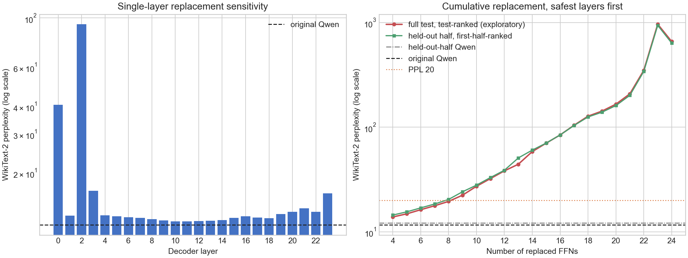

# Full-path P-DNN expansion from 4 to 24 FFNs

This experiment determines how many independently distilled full-path bipolar
P-DNN FFNs can be composed before language-model quality becomes unusable. All
24 Qwen2.5-0.5B decoder layers were trained with the same v1 configuration:

```text
continuous x -> input p-bits -> W_in -> hidden p-bits -> W_out -> path average
```

Each student uses input temperature 0.25, hidden temperature 1.0, 2,000
mean-field steps, 2,000 four-path sample-aware steps, and seed 0. Every learned
matrix receives strictly bipolar activations. Weights, accumulated fields,
readouts, residuals, attention, and the rest of Qwen remain continuous.

## Layer selection

The initial exploratory ranking used full WikiText-2 test perplexity. To avoid
using the same tokens for both selection and final measurement, the standard
299,078-token test corpus was then divided at token 149,539:

- first half: rank all 24 single-layer replacements;
- second half: freeze that order and evaluate cumulative replacement;
- second-half original-Qwen baseline: **12.156266**.

The first-half ranking is:

```text
10, 11, 12, 13, 9, 14, 8, 18, 15, 7, 17, 6,
16, 1, 5, 4, 19, 20, 22, 21, 23, 3, 0, 2
```

The first eight positions are identical to the exploratory full-test ranking.
Thus the location of the main 6–10-layer degradation region is not caused by
reusing the complete test set for ranking.

## Single-layer sensitivity

The table is ordered by decoder layer. `Selection-half PPL` determines the
held-out cumulative order. `Full-test PPL` is retained for comparison with all
previous repository results.

| Layer | Selection-half PPL | Full-test PPL |
| ---: | ---: | ---: |
| 0 | 35.755772 | 40.512179 |
| 1 | 12.277686 | 12.841905 |
| 2 | 89.342431 | 93.668280 |
| 3 | 15.966318 | 16.589941 |
| 4 | 12.350976 | 12.866546 |
| 5 | 12.292520 | 12.754382 |
| 6 | 12.140679 | 12.627425 |
| 7 | 12.052976 | 12.541575 |
| 8 | 11.866177 | 12.358940 |
| 9 | 11.722400 | 12.214694 |
| 10 | **11.613273** | **12.094500** |
| 11 | 11.622080 | 12.111059 |
| 12 | 11.627422 | 12.117123 |
| 13 | 11.690643 | 12.186549 |
| 14 | 11.773941 | 12.271976 |
| 15 | 12.036612 | 12.542750 |
| 16 | 12.218709 | 12.755224 |
| 17 | 12.062729 | 12.579942 |
| 18 | 11.948495 | 12.497141 |
| 19 | 12.467073 | 13.029271 |
| 20 | 12.783531 | 13.335997 |
| 21 | 13.219369 | 13.828664 |
| 22 | 12.786405 | 13.344539 |
| 23 | 15.447116 | 16.158388 |

Layers 0 and 2 are catastrophic even in isolation, and layers 3 and 23 are
also unusually sensitive. The safest region is centered on layers 9–14. Layer
importance is therefore strongly non-monotonic.

## Cumulative replacement curve

`Exploratory full-test PPL` ranks and evaluates on the complete test set. The
held-out column ranks on the first half and evaluates only on the second half.
The close agreement supports the qualitative break point.

| Replaced FFNs | Exploratory full-test PPL | Held-out-half PPL | Held-out change from 12.156266 |
| ---: | ---: | ---: | ---: |
| 4 | 13.895235 | 14.486875 | +19.17% |
| 5 | 14.883334 | 15.547150 | +27.89% |
| 6 | 16.295958 | 16.965923 | +39.57% |
| 7 | 17.782717 | 18.477164 | +52.00% |
| 8 | 19.563131 | 20.437910 | +68.13% |
| 9 | 22.439143 | 24.186474 | +98.96% |
| 10 | 27.281134 | 27.972574 | +130.11% |
| 11 | 32.317730 | 33.069964 | +172.04% |
| 12 | 38.289371 | 38.812370 | +219.28% |
| 13 | 44.311338 | 50.887336 | +318.61% |
| 14 | 58.512325 | 60.448573 | +397.26% |
| 15 | 70.458435 | 70.630065 | +481.02% |
| 16 | 84.418656 | 84.453616 | +594.73% |
| 17 | 104.478068 | 103.878335 | +754.52% |
| 18 | 127.520215 | 125.408973 | +931.64% |
| 19 | 142.581908 | 139.179698 | +1044.92% |
| 20 | 166.089720 | 161.035296 | +1224.71% |
| 21 | 208.467970 | 201.690844 | +1559.15% |
| 22 | 349.652706 | 341.396299 | +2708.40% |
| 23 | 964.648336 | 940.738219 | +7638.71% |
| 24 | 659.518603 | 637.287566 | +5142.46% |

The decrease from 23 to 24 replacements is not a recovery: both models are
far beyond useful language-model quality, and the last two individually
catastrophic layers interact nonlinearly under a severely shifted activation
distribution.

## Sampling and seed controls near the break point

These checks use the exploratory full-test order because the first eight
selected layers match the split ranking. The `N=4` value is the population
mean and population standard deviation across seeds 0, 1, and 2.

| Replaced FFNs | Mean-field PPL | N=4 PPL | N=16 PPL |
| ---: | ---: | ---: | ---: |
| 4 | 13.715394 | **13.895320 ± 0.001680** | 13.758046 |
| 6 | 15.912122 | **16.302179 ± 0.006730** | 16.009786 |
| 8 | 18.864517 | **19.575583 ± 0.009831** | 19.041754 |
| 10 | 25.547497 | **27.305092 ± 0.021530** | 26.018616 |

Seed variance is negligible compared with the increase caused by adding
independently trained layers. More samples help, but even mean-field inference
has the same rapid degradation. The dominant error is structural and comes
from composition under shifted upstream distributions.

## Practical break point

There is no task-independent definition of "unacceptable", so the measured
curve supports several explicit gates:

| Quality gate | Largest passing replacement count |
| --- | ---: |
| Held-out PPL increase no more than 25% | 4 |
| Held-out PPL increase no more than 50% | 6 |
| Held-out absolute PPL below 20 | 7 |
| Held-out PPL less than twice the original | 8 |

The eighth replacement reaches PPL 20.44 and the ninth nearly doubles the
baseline at 24.19. Under a lenient engineering definition, **8 replaced FFNs
is the boundary and 9–10 is clearly unacceptable**. Under a quality-sensitive
deployment gate, degradation is already excessive after 4–6 independently
distilled replacements.

This result does not support expanding the current independent objective to 24
layers. The next experiment should jointly adapt the first safe group
`{10,11,12,13}` or the first six `{9,10,11,12,13,14}` with teacher-logit KL and
next-token loss before attempting more replacements.



## Checkpoint identities

The approximately 104.7 MB sample-aware checkpoints remain on the experiment
server.

| Layer | SHA-256 |
| ---: | --- |
| 0 | `4cc3c864477f56d63e59f8ec392fabd986201a32477de3259b9cf04f4da44dd6` |
| 1 | `75e151eedef8d4e58d0897e667e372086479bd05f72d0bc8b44ed5a9f070a185` |
| 2 | `6261216effc1d68c170a9635927ffc2730189840768bda4d884ffee1abf0a3f3` |
| 3 | `6876da32fd996222d233159d123284edc3fb053aa8d3fe7f91435e6cad6792b0` |
| 4 | `299c4ea2e52e47036805447ba9352a018e2933d25d039a7c79267b5b0e17bbd8` |
| 5 | `ce182af724a53a1cfdcb89633443339b6404395eee065de677eebec04bf9667b` |
| 6 | `bdea3a5fe756e9e786d5597757ad5b5076a1ec950e255ae3a805a438b0208208` |
| 7 | `e189dc0658f38d0a58c615a0482649988671ca4bdaff196744b268af32ba44cf` |
| 8 | `cb09503344e8d65b2e60f5a6f35abf38288e5c8e5c868aba42c6384e416f5fba` |
| 9 | `37f33991c2c1fff34e390f341e6e515c879862e51d7a30af5b9a97566bbec0f0` |
| 10 | `e1e153d356d885811d9913f2e38191bacdb6ac96ea063554519f410dce40c93e` |
| 11 | `33906e954701eab477a55242dd78dd6b8ca9e99b6067f677d584670a1c0aca9c` |
| 12 | `24cdcf43c8e643ea27ccb1427218b1b97b53f80a2750b09e1d3b62f18e046912` |
| 13 | `a23184f71ae8a8e3b240fd7edfab38ce0a125cdaa51f353a3a24c4f25df43ea7` |
| 14 | `05f5aad6c4de03af7ab7df15fff38ace79924767264761df6cf12ebda83a499f` |
| 15 | `148202fd25bc394197886e51f0df32294a1a39098cf67082341020651741f2d2` |
| 16 | `0cbf3b2dbd8a8b8f7c484d22402c7983abaf655e5537015904afdef3efe62275` |
| 17 | `a3645c3f138738ff3eb53b88ae17ed33e298475fc75851810db73235a709e414` |
| 18 | `2f7d5cc7a0e40927e9a93cfd51e6e6e7c6f4dd9ff1f07269e3ad825d25cf54a8` |
| 19 | `136083be39a358f7fee3b91c7ad5fc1ac193990ba7b2c0466c1b8b65de8fa2c9` |
| 20 | `1e4a44016ba44f05ba0a658fc54a6fa8f11da8854a001791ca2757203e99839c` |
| 21 | `29cbbf44093328fc40c2fc4a1ecf6bf56a2e5ad2e0d02ae1d83edc9b06c5833b` |
| 22 | `d2dba0cdba1e4f376c074d93e24d749ad6f8640c2477eda623b8f67f487ea9ab` |
| 23 | `6f0a77b7b110d9d5541cebb6be588bf0dbbf90915e75761bb5cdfa4e81bddfc6` |
