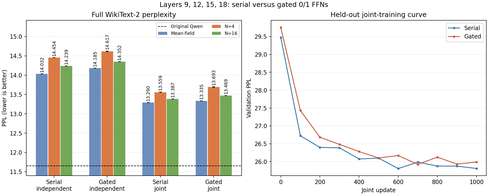

# 四层0/1 FFN：串联与门控结构对照

日期：2026-09-30

## 结论

在第 `{9,12,15,18}` 层、近等参数量、相同训练数据和更新步数下，
**门控结构没有改善四层替换质量，联合训练后仍比串联结构差0.1342 PPL。**
门控在独立组合和联合训练后的 mean-field、N=4、N=16 三种模式下均较差，
局部单层 NMSE 也在三个新训练层上全部较差。当前证据不支持把门控结构扩大到
十层或二十层；后续默认应保留较简单的串联结构。

这是一组训练 seed。三个 N=4 推理 seed 只能估计随机推理波动，不能估计训练
初始化方差。因此可判断“本实现没有显示出改善”，不能证明所有可能的门控结构
在任何训练方案下都不可能有效。

## 公平对照

四个 decoder FFN 层为 `{9,12,15,18}`。选择这组是因为之前的层筛选表明它避开
layer 0 等高敏感层，适合观察普通中间层的误差累积。

| 设置 | 串联 | 门控双路读出 |
| --- | ---: | ---: |
| 单层参数 | 8,722,050 | 8,721,879 |
| 四层参数 | 34,888,200 | 34,887,516 |
| 隐藏宽度 | 4,864 | 两分支各3,242 |
| p-bit独立阈值 | 无 | 无 |
| 矩阵偏置 | 保留 | 保留 |
| 状态传播 | 0/1 | 0/1 |
| 单条路径稠密乘加项 | 基准 | 约多33.3% |

门控的正负二值轨共享读出权重，输出偏置只加一次。参数量只差684，但门控的
矩阵运算和 p-bit 数更多，所以这是近等参数量、等更新步数对照，不是等计算量对照。

每个单层模型先训练2,000步 mean-field，再训练6,000步 N=4。第12层复用上一轮
相同协议的 checkpoint；第9、15、18层本轮重新训练。所有模型训练 seed=0，
batch=4、sequence=256、采样阶段学习率1e-4，验证 RNG 与训练 RNG 隔离。

独立组合后，两种结构分别进行1,000步端到端联合蒸馏：

```text
loss = 0.8 * KL(original-Qwen logits || four-layer student logits)
     + 0.2 * next-token cross entropy
sample count = 4
sequence length = 256
micro batch = 1
gradient accumulation = 4
learning rate = 1e-5, 50-step warm-up + cosine decay
```

其余模型参数全部冻结。最后65,536个 WikiText-2 train token 仅用于联合 checkpoint
选择。完整 WikiText-2 test 仅在训练结束后使用。串联最佳验证 checkpoint 在step600，
门控在step700；没有用 test PPL 选择 checkpoint。

## 完整测试集结果

完整 test 共299,078 token、计分299,077，max-length=2048、stride=1024。
N=4 为推理 seeds0/1/2 的均值与总体标准差；其他模式为 seed0。
原始 Qwen PPL 为11.652735。

| 阶段 | 结构 | Mean-field | N=4 | N=16 |
| --- | --- | ---: | ---: | ---: |
| 独立组合 | 串联 | **14.031971** | **14.454435 ± 0.001626** | **14.238733** |
| 独立组合 | 门控 | 14.184851 | 14.616643 ± 0.006550 | 14.351711 |
| 联合训练 | 串联 | **13.290285** | **13.559058 ± 0.003787** | **13.386762** |
| 联合训练 | 门控 | 13.335065 | 13.693251 ± 0.003934 | 13.469430 |

独立组合时，门控 N=4 比串联高0.162208；联合训练后仍高0.134194。
联合训练使串联降低0.895377、门控降低0.923392，门控多恢复约0.028 PPL，
但不足以消除初始差距。联合后的 mean-field 差0.044781、N=16差0.082668，
所以差异不只来自四次采样的随机波动。

门控和串联 N=4 差距约为各自推理 seed 总体标准差的34倍以上。
这说明差异不是当前三次推理抽样波动造成的；但只有一个训练 seed，不能据此
给出跨训练初始化的统计显著性结论。



## 单层局部结果

下表是三个本轮新训练层在最终 N=4 保留集上的局部 NMSE；第12层另见上一轮报告。

| Layer | 串联 | 门控 | 门控减串联 |
| ---: | ---: | ---: | ---: |
| 9 | **0.504101** | 0.533149 | +0.029048 |
| 15 | **0.416613** | 0.454404 | +0.037791 |
| 18 | **0.480818** | 0.512405 | +0.031586 |

门控在三个新层上都没有局部优势。结合第12层长训结果，当前门控主要表现为
更复杂的随机表示，而不是更高的任务有效容量。

## 训练成本

六个新单层模型在六张 RTX5090 上并行训练。串联单层约160–164秒、峰值
allocated memory 1.24GiB；门控约192–204秒、峰值1.34GiB。

联合训练每组使用一张 RTX5090：

| 结构 | 1,000步耗时 | 吞吐 | 峰值 allocated memory | 最佳验证PPL |
| --- | ---: | ---: | ---: | ---: |
| 串联 | 248.13秒 | 4,126.85 token/s | 3.80GiB | **25.806280** |
| 门控 | 286.97秒 | 3,568.26 token/s | 3.90GiB | 25.924983 |

门控联合训练慢15.65%，峰值 allocated memory 高2.79%。这些是当前 PyTorch
稠密实现的数据，不等于专用 p-bit 硬件的能耗或延迟；但硬件实现也需要承担
额外分支与双路读出的结构成本。

## 决策

当前门控结构在单层有时能得到接近串联的 PPL，但四层实验没有出现误差累积优势。
相反，它在局部 NMSE、四层独立组合、联合训练后完整 PPL 和软件计算成本上均较差。
因此不继续将这版门控扩展到十层或二十层，也不把它作为主方案。

后续应回到串联0/1 P-DNN，把实验预算放在直接降低多层确定性误差的方向，例如：

- 分阶段采样课程（高 N 训练后逐步降到部署 N=4），但必须给串联相同预算；
- 中间 hidden-state matching；
- 小规模连续或低秩误差补偿，并单独核算硬件代价。

所有公开 JSON/JSONL、协议、训练摘要、测试结果和 checkpoint SHA256 均在本目录。
大型 checkpoint 保留在远程同名目录，公开结果不含权重。汇总见
[comparison.json](comparison.json)。本轮正式训练和评估均完整结束。
