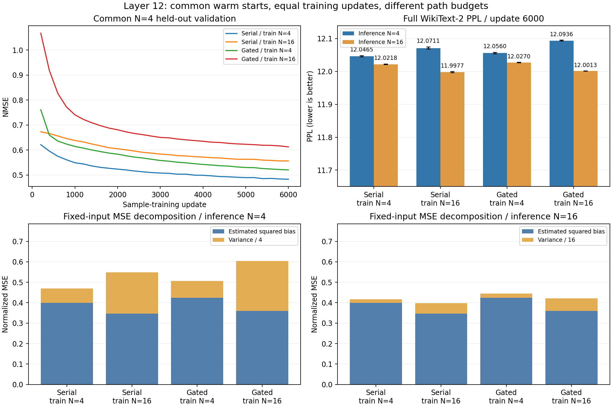

# 第12层续训：训练采样数和训练时长的影响

**续训有效，但门控尚未超过同预算串联。训练用 N=16 改善了 N=16 推理，
却使 N=4 推理变差。真实采样诊断支持平均误差与随机方差之间存在取舍。**

本轮四组各完成6,000步采样训练、合计56次完整 test PPL 与12组重复采样诊断。
只有第12层 FFN 被替换，矩阵偏置和0/1传播保持不变。

## 方法

- 串联宽度4864、门控宽度3242，沿用近等参数量设置。
- 每个结构的 train4/train16 从同一个第2,000步 mean-field 预热 checkpoint 分叉，
  恢复权重、温度和 Adam 状态。两条分支的初始 checkpoint SHA256 已核对一致。
- 各组采样训练6,000步，batch4×sequence256，共6,144,000 token；
  学习率1e-4，其他训练参数不变。比较第2,000步和第6,000步。
- 所有组共用随机训练窗口；窗口生成器跳过预热使用的2,000批。
  旧 checkpoint 未保存 RNG 状态，因此恢复后重新设 seed0，不能逐位重放旧实验。
- 验证统一用 N=4，并隔离验证 RNG，避免验证干扰后续训练随机数。
- N=16 每步使用4倍随机路径；这是等步数/等数据量比较，不是等计算预算。
- 完整 WikiText-2 test，299,077个计分 token，max-length2048、stride1024。
  每个 checkpoint 的 N=4、N=16 都用推理 seeds0/1/2，mean-field 用 seed0。
  表中 ± 为三个推理 seeds 的总体标准差，不能代表训练种子的置信区间。
- 预先指定第2,000/6,000步作评估，不按 test PPL 选择 checkpoint。

## 完整 PPL

原 Qwen PPL：11.652735。下表步数不包含共同的2,000步预热。

| 结构 | 训练 N | 采样训练步数 | Mean-field | 推理 N=4 | 推理 N=16 |
| --- | ---: | ---: | ---: | ---: | ---: |
| 串联 | 4 | 2000 | 12.019175 | 12.065781 ± 0.001298 | 12.036542 ± 0.001072 |
| 串联 | 4 | 6000 | 12.002341 | **12.046547 ± 0.001808** | 12.021756 ± 0.001084 |
| 串联 | 16 | 2000 | 11.981333 | 12.097122 ± 0.002551 | 12.014477 ± 0.002133 |
| 串联 | 16 | 6000 | 11.966559 | 12.071149 ± 0.003545 | **11.997728 ± 0.001630** |
| 门控 | 4 | 2000 | 12.048057 | 12.101067 ± 0.001235 | 12.067466 ± 0.001735 |
| 门控 | 4 | 6000 | 12.008790 | **12.056005 ± 0.002190** | 12.027001 ± 0.000697 |
| 门控 | 16 | 2000 | 11.996598 | 12.138916 ± 0.002977 | 12.037105 ± 0.000863 |
| 门控 | 16 | 6000 | 11.965574 | 12.093583 ± 0.001407 | **12.001255 ± 0.000273** |

1. 延长 N=4 训练，门控 PPL 从12.101067降到12.056005；串联从12.065781
   降到12.046547。两者差距从0.035286缩到0.009458。
2. 在6,000步下，门控 train16/infer16 达到12.001255，接近串联对应的11.997728，
   仍未胜出。不能因为接近就认定在多次训练或多层替换下等效。
3. 对门控模型，训练 N 从4改成16，推理 N=4 反而从12.056005变为12.093583。
   因此“训练多采样，部署少采样”不能自动获得收益。
4. mean-field 最低约11.9656，接近串联，但它不是随机模型精确的无限采样期望。

## 固定输入上的真实采样误差分解

统一选取保留训练尾段中的1,024个 token，输入来自原 teacher。
每个输入采样256条完整路径，用无偏方差估计，并对有限采样均值的平方误差
扣除 `variance/256`。下面各量均除以相同的目标输出均方。
“平均误差”指随机输出期望相对 teacher 的平方误差估计，不是矩阵偏置参数。

| checkpoint | 平均误差估计 B | 单路径方差 V | 预测 N=4 NMSE，B+V/4 | 预测 N=16 NMSE，B+V/16 |
| --- | ---: | ---: | ---: | ---: |
| 串联预热结束 | 0.410845 | 1.220164 | 0.715886 | 0.487105 |
| 门控预热结束 | **0.379118** | **5.470924** | 1.746849 | 0.721050 |
| 串联 train4，6000步 | 0.399067 | 0.283158 | 0.469856 | 0.416764 |
| 串联 train16，6000步 | 0.346968 | 0.804765 | 0.548160 | 0.397266 |
| 门控 train4，6000步 | 0.424058 | 0.329257 | 0.506372 | 0.444637 |
| 门控 train16，6000步 | **0.360312** | **0.978123** | 0.604843 | 0.421445 |

预热结束时，门控的平均映射确实更准确，但单路径方差约为串联的4.48倍。
这给上轮的“切换采样后优势消失”提供了更直接的证据。

门控的 N=4 训练显著抑制方差，但平均误差由预热的0.379118增至0.424058；
N=16 训练则把平均误差降至0.360312，同时允许方差保留到0.978123，
约为 train4 结果的2.97倍。除以16时有益，除以4时就不足以抵消噪声。

这些预测值与直接分组、使用实际 BF16 累加测出的 N=4/16 NMSE 接近；
例如门控 train16 的6,000步 N=4 预测0.604843、实测0.604845。
诊断仅使用一个固定输入子集和一个采样种子，估计具有采样误差；不是全语料
局部误差，也不是多层联合替换产生的输入分布。FFN 局部 NMSE 不与 PPL 一一对应。

## 资源与结果完整性

| 结构 | 训练 N | 6,000步秒数 | 训练峰值 allocated memory |
| --- | ---: | ---: | ---: |
| 串联 | 4 | 144.77 | 1.24GiB |
| 串联 | 16 | 197.69 | 1.65GiB |
| 门控 | 4 | 154.12 | 1.34GiB |
| 门控 | 16 | 272.47 | 2.07GiB |

每组使用一张 RTX5090；四组并行。耗时含验证与保存，不包含后续完整 PPL
与采样诊断，也不包含此前共同预热。GPU 总占用、保留内存及其他进程不计入 allocated。

SSH 会话在实验过程中断开，但子进程继续完成所有训练和评估。最后向断开的
stdout 打印完成消息时触发 BrokenPipe，误把任务标成失败。核对四份完成摘要、
八个 checkpoint SHA256、56个 PPL 文件和12个矩诊断文件后恢复完成状态；
没有重跑训练或修改数值结果。记录见 `completion_recovery.json`。
运行器已修复此情况，运行时原版本保留在 `runner_source_at_launch.py`。

结构测试4项、矩诊断测试2项通过，并完成短续训检查。所有正式训练和评估完成。
checkpoint 保留在远程对应目录，公开记录不含权重；路径以占位符代替。
汇总与哈希见 [comparison.json](comparison.json)，协议见 [protocol.json](protocol.json)。
图在本机使用 Python3.8/Matplotlib3.7.5 生成；远程训练环境未安装绘图库。

## 当前建议

若部署目标是4次采样，目前仍优先串联 train4；门控已经接近，但没有超过。
如果允许16次采样，可以使用 train16 对照继续研究，但不能据此承诺4次采样质量。
本轮不直接扩大替换层数。若继续优化门控，下一项有针对性的实验是较高 N
训练后逐步降低到部署 N 的训练方案，并给串联同样预算；收益仍需要验证。
