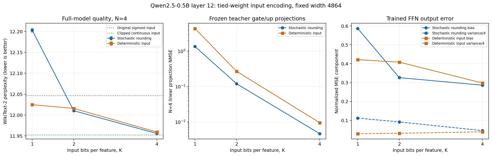

# 第12层入口多位编码实验

## 结果与判断

4位入口编码有效。完整WikiText-2上，N=4 PPL从原sigmoid入口的12.046547
降到11.955722，改善0.090826；裁剪后的连续入口对照为11.952216。
4位随机编码恢复了原入口与连续入口之间PPL差值的约96.3%，且没有增加
可学习矩阵参数。这是本轮训练条件下的经验差距，不是连续入口的理论性能上界。

确定性4位入口也达到11.959206，说明主要收益来自幅值表示；随机编码比它
好0.003485，但训练seed只有一个，不能宣称随机编码有稳定统计优势。
原始完整Qwen PPL为11.652735，4位入口仍未完全恢复原FFN质量。

## 协议与比较范围

全部只替换layer12，普通串联FFN隐藏宽度固定4864，隐藏层p-bit为0/1，
矩阵偏置与隐藏温度可学习。八组均从共同初始化矩阵开始重新训练，使用相同
随机训练窗口：2000步mean-field预热+6000步N=4，batch4、sequence256、
NMSE+0.05*(1-cosine)，学习率3e-4/1e-4。不同编码的实际随机流和训练轨迹不同。

入口范围使用训练集32768个teacher输入token，各通道取abs的99.9%分位数，
排除末65536个验证token；不读test、不用test挑范围或checkpoint。
1024个固定保留输入token上的裁剪率为0.09286%。各编码共享同一范围。

完整PPL计分299077个token，窗口2048、stride1024；N=4使用seed0/1/2，
mean-field和N=16各用seed0。±为推理seed总体标准差，不是训练seed置信区间。
所有最终checkpoint均检查phase=full_path_sample_aware、phase step=6000。
本轮原sigmoid基线的PPL与此前基线复现一致。

“确定性入口”仅表示入口采用最近档位量化，其后的隐藏p-bit仍在N>0时采样。
“连续入口”也是训练后的串联student，保留入口裁剪，不是原始Qwen SwiGLU。
mean-field只是替代诊断，不能作为完整随机网络的精确期望。

## 完整PPL

| 入口 | Mean-field | N=4 PPL | N=16 |
| --- | ---: | ---: | ---: |
| 原sigmoid入口 | 12.002341 | 12.046547 ± 0.001808 | 12.021689 |
| 连续入口（相同裁剪） | 11.930675 | 11.952216 ± 0.000763 | 11.936998 |
| 随机位置位 K=1 | 12.096545 | 12.202956 ± 0.004160 | 12.156458 |
| 随机位置位 K=2 | 11.948613 | 12.010299 ± 0.001870 | 11.973880 |
| 随机位置位 K=4 | 11.932756 | 11.955722 ± 0.000283 | 11.938945 |
| 确定性入口 K=1 | 12.008212 | 12.024758 ± 0.000742 | 12.013099 |
| 确定性入口 K=2 | 11.998884 | 12.015877 ± 0.001035 | 12.003418 |
| 确定性入口 K=4 | 11.940435 | 11.959206 ± 0.000744 | 11.941718 |

## 编码如何工作

每个通道范围为[-a,a]，L=2^K-1，把裁剪值转换为r=(x/a+1)*L/2。
随机编码在floor(r)和ceil(r)之间按距离比例取值；确定性编码取最近档位。
整数q写成K个0/1位置位，解码为x_hat=-a+(2a/L)*sum_k 2^k*b_k。

输入矩阵实现为逐位W*diag(2a*2^k/L)*b_k，再将固定下端点-W*a折入偏置。
所有采样前向的实际矩阵输入均为0/1，没有把解码出的连续数直接送入输入矩阵。
各位共享一个W，不增加独立矩阵参数。跨位加权相加是数值编码重建；不同随机
路径仍只在最终读出之后平均，没有在隐藏层提前做路径平均。

相邻档位随机舍入是协调编码位的算法参考，不等同于K个独立sigmoid p-bit。
它需要范围裁剪、档位确定、随机舍入和位置位输出。当前结果验证了表示方案，
并未测量其真实p-bit电路能耗，也未证明无需附加编码电路即可实现。

## 原teacher投影的入口误差诊断

冻结原gate/up矩阵，在共同1024个保留输入token上分析线性投影误差。
随机编码的裁剪偏差与方差按独立输入坐标的精确矩公式计算。
这里的N=4投影NMSE是四个投影样本均值的诊断指标，不表示训练网络在此处
实际平均；真实前向继续各自通过非线性、最终输出才平均。

| K | 随机入口 N=4投影NMSE | 确定性入口投影NMSE |
| --- | ---: | ---: |
| 1 | 1.366620 | 4.418222 |
| 2 | 0.120977 | 0.272016 |
| 4 | 0.004672 | 0.009536 |

单纯入口裁剪的投影NMSE为0.00005548。1位随机编码虽然在范围内无偏，
为表示宽幅值范围而需要大幅度±a样本，方差很大。4位把相邻档位间距缩小到
2a/15，有效降低单次数值扰动。这是与“增加隐藏特征数”不同的机制。
固定teacher投影诊断与训练后student的表现并非一一对应：后者可以适配权重，
不能只用前者的单项误差决定完整模型质量。

## 训练后FFN偏差和方差

共同1024个teacher输入token，每输入采样256条完整路径。bias为校正有限
采样误差后的平方偏差NMSE，variance为单路径方差；N=4预测误差=bias+variance/4。

| 入口 | bias NMSE | 单路径variance NMSE | N=4经验NMSE |
| --- | ---: | ---: | ---: |
| 原sigmoid入口 | 0.399067 | 0.283158 | 0.469867 |
| 连续入口（相同裁剪） | 0.284896 | 0.161324 | 0.325241 |
| 随机位置位 K=1 | 0.586968 | 0.447105 | 0.698750 |
| 随机位置位 K=2 | 0.326275 | 0.364863 | 0.417449 |
| 随机位置位 K=4 | 0.286091 | 0.181352 | 0.331435 |
| 确定性入口 K=1 | 0.421749 | 0.116744 | 0.450933 |
| 确定性入口 K=2 | 0.408499 | 0.123829 | 0.439453 |
| 确定性入口 K=4 | 0.297524 | 0.156131 | 0.336571 |

相对原sigmoid入口，4位随机编码bias降低28.3%、单路径方差降低36.0%，
经验N=4 NMSE降低29.5%。所以收益不只是输出采样更稳定，平均映射也更接近teacher。
连续入口的bias仍为0.284896，4位为0.286091；本轮入口表示误差已经大幅缩小，
后续可优先研究隐藏幅值、SiLU乘积结构与训练，不能把剩余误差全部归因于入口。
这些是局部输入上的误差分解，不可当作PPL误差比例或多层替换的证明。

## 参数与成本

原模型student有8,722,050个可学习参数；多位和连续入口都是8,722,049个，
少掉的一个是被固定编码范围替代的入口温度。896个每通道范围是冻结校准buffer。
多位模型的K改变不会增加独立可学习权重数，但增加二值矩阵计算和累加次数。

N=4时原串联有8次矩阵运算（4次入口+4次读出）；4位入口有20次
（16次位平面投影+4次读出）。理想稠密矩阵项数从34,865,152增至87,162,880，
即2.5倍；这未包含编码、偏置修正和状态生成。位权共享或数字移位可影响真实
实现成本，但不能仅因p-bit便宜就忽略这些开销。

| 入口 | 完整训练秒数 | 峰值allocated GiB |
| --- | ---: | ---: |
| 原sigmoid入口 | 170.63 | 1.237 |
| 连续入口（相同裁剪） | 163.11 | 1.214 |
| 随机位置位 K=1 | 183.40 | 1.216 |
| 随机位置位 K=2 | 183.18 | 1.238 |
| 随机位置位 K=4 | 196.51 | 1.247 |
| 确定性入口 K=1 | 177.59 | 1.216 |
| 确定性入口 K=2 | 177.80 | 1.237 |
| 确定性入口 K=4 | 182.32 | 1.249 |

4位随机编码软件训练约196.51秒，比原入口170.63秒慢约15.2%；8组并行在
8张空闲RTX5090上运行，该比例受并行CPU/存储/算子开销影响，不是硬件能耗比。
完整PPL评估峰值约4.99GiB。权重仍存于远程，未纳入本地结果目录。

## 下一步

保留K=4为优先候选，K=2为较低成本候选。先在固定层集做多层组合与联合训练
验证误差累积，再决定是否扩展到10/20层。另需独立验证可实现的多阈值或位权
编码器；不要把理想随机舍入的结果直接归为物理p-bit实现。若继续提高单层质量，
连续入口对照已提示优先检查隐藏幅值和SwiGLU乘积结构，而非继续加入口位数。

## 文件与核验

`protocol.json`、`calibration.json`、`projection_audit.json`记录协议和校准。
`evaluation/`包含40次完整PPL；`moments/`包含8组矩诊断；`training/`包含训练
曲线和summary；`checkpoints/`包含最终权重哈希及phase step。
`source_sha256.json`记录远程执行源码哈希；`comparison.json/csv`为统一汇总。

`run_multibit_input_experiment.py`拒绝覆盖已有结果，启动前验证GPU空闲；
所有训练与评估结束后生成status=complete。多位编码相关5项测试及既有门控/
矩估计6项测试，在本地和远程均通过，共11项。结果仅一个训练seed，不宣称
多种数据集、任务或层数下必然同样改善。
