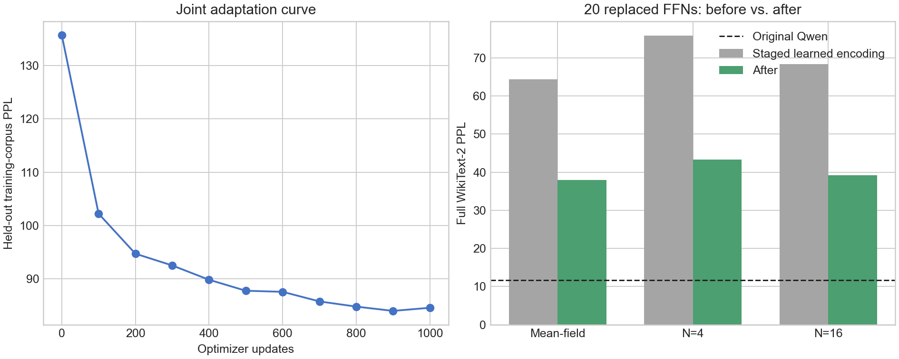

# 二十层 0/1 可学习编码联合训练

日期：2026-09-29

## 实验设置

本实验使用与旧二十层实验相同的 decoder 集合：

```text
{1, 4, 5, 6, 7, 8, 9, 10, 11, 12,
 13, 14, 15, 16, 17, 18, 19, 20, 21, 22}
```

保留 layer 0、2、3、23 的原始 Qwen FFN。layer 7–15和18使用最新十层
0/1可学习编码联合模型，其余十层使用独立训练的0/1可学习编码 student。
每个 p-bit 边界分别学习标量阈值和正温度，两个矩阵的实际输入均为0或1。

联合训练沿用此前协议：N=4硬采样、`0.8 teacher-logit KL + 0.2
next-token CE`、1,000个 optimizer updates、每步有效1,024 token、学习率
1e-5、50步 warm-up和 cosine decay。

## 阶段结果

完整 WikiText-2 test 的 N=4 结果如下。三 seed 结果用总体标准差表示；
“全独立”仅运行 seed 0。

| 阶段 | 旧 ±1 编码 | 新 0/1 可学习编码 |
| --- | ---: | ---: |
| 20个独立 student | 166.089720 | **108.161196** |
| 十层联合 + 十层独立 | 101.374861 | **75.855991 ± 0.077163** |
| 二十层联合训练后 | 48.910814 ± 0.096274 | **43.383146 ± 0.009963** |

新编码使全独立二十层 seed-0 PPL 降低34.88%，分阶段初始化降低25.17%，
最终联合模型降低11.30%。相对旧二十层最终模型，它恢复了额外 NLL 的
8.36%。

新模型从分阶段初始化到联合训练后，N=4 PPL 降低32.472845，即42.81%，
恢复了相对原 Qwen 所增加 NLL 的29.83%。联合训练仍然非常有效，但最终
PPL 仍比原模型11.652735高272.30%。

## 多采样结果

| 推理模式 | 旧二十层联合模型 | 新二十层联合模型 | 改善 |
| --- | ---: | ---: | ---: |
| Mean-field，seed 0 | 42.881774 | **38.008323** | -4.873451 |
| N=4，3 seeds | 48.910814 ± 0.096274 | **43.383146 ± 0.009963** | -5.527668 |
| N=16，seed 0 | 43.840279 | **39.207920** | -4.632359 |

新模型三个 N=4 seed 分别为43.370827、43.395228和43.383384。N=16
相对 N=4 明显改善，但 mean-field 本身仍为38.008323，因此增加采样数无法
把二十层模型带回可接受范围。



## 训练成本

一张 RTX 5090 上耗时506.51秒（8分27秒），有效吞吐2,021.70 token/s，
峰值 allocated memory 为6.26 GiB。最佳验证点在step 900，PPL 从
135.745839降至84.009751；step 1,000回升到84.595755。与旧二十层实验
相比，训练多约67秒，峰值 allocated memory 增加约0.24 GiB。

## 编码饱和和层消融

二十层联合模型的平均入口温度为0.236572，平均入口饱和度为21.28%；平均
隐藏温度为0.286247，平均隐藏饱和度为33.77%。饱和定义为0/1概率小于
0.01或大于0.99。

layer 21 明显异常：入口温度0.103238、入口饱和66.61%，隐藏温度0.392417、
隐藏饱和93.38%。不过完整模型消融显示误差并不只由这一层决定。以下结果均
使用二十层联合 checkpoint、N=4 seed 0，只把指定层恢复为原始 Qwen FFN：

| 模型 | 替换层数 | PPL |
| --- | ---: | ---: |
| 完整二十层模型 | 20 | 43.370827 |
| 恢复 layer 1 | 19 | 44.193252 |
| 恢复 layer 17 | 19 | 41.147644 |
| 恢复 layer 20 | 19 | **39.848899** |
| 恢复 layer 21 | 19 | 39.934467 |
| 恢复 layer 22 | 19 | 40.894713 |
| 同时恢复 layer 20、21 | 18 | 36.505831 |
| 同时恢复 layer 17、20、21、22 | 16 | **31.698282** |

晚期 decoder 层17、20、21、22贡献了很大的累积误差。恢复 layer 1反而
变差，说明联合训练后各层已经共同适应，单层局部敏感度不能直接解释联合模型。
这些消融没有重新训练16/18/19层模型，因此只用于定位，不是相同训练条件下的
最终容量比较。

## 结论

逐层可学习0/1编码在二十层上继续有效，而且从独立初始化到最终联合模型的
每个阶段都优于旧 ±1 方案。然而，20层 N=4 PPL 仍为43.38，明确不可接受。
当前结构不适合继续扩展到更多层。

后续更合理的实验边界是十层，或重新训练一个排除 layer 17、20、21、22 的
16层模型。若目标是接近原始 PPL，优先增加 residual/低秩连续补偿和中间
hidden-state matching；仅继续优化标量温度、采样数或层数不会消除主要误差。

本目录保存训练曲线、PPL、逐层饱和度和消融 JSON。大型 checkpoint 保留在
远程服务器，其身份见 [`checkpoint_hashes.sha256`](checkpoint_hashes.sha256)。
