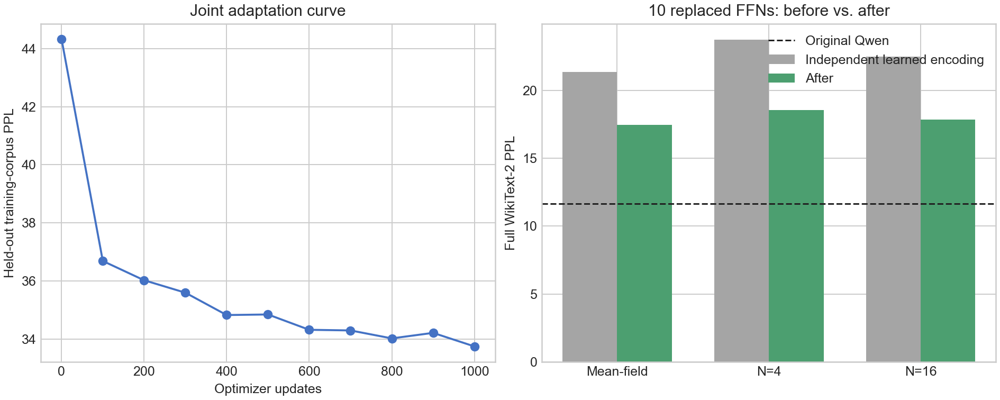

# 十层 0/1 可学习编码联合训练

日期：2026-09-29

## 实验问题

上一轮在三个代表层上证明，每个 decoder FFN 独立学习 p-bit 阈值和温度
可以减少概率过早饱和。本实验把同样方法扩展到此前使用的十层集合：

```text
{7, 8, 9, 10, 11, 12, 13, 14, 15, 18}
```

目标是判断逐层编码与端到端联合蒸馏结合后，能否把十层替换模型从旧结果
`19.2261` 推近原 Qwen 的 `11.6527`。

## 初始化和训练

十个 FFN 均使用0/1完整路径，每个 FFN 在入口和矩阵之间分别学习一个标量
阈值与正温度。每个独立 student 先训练2,000步 mean-field，再训练2,000步
N=4硬采样。矩阵的实际输入始终为0或1，反向使用概率均值 STE。

随后把十个 student 同时装入 Qwen，冻结其余参数，用最终词表 logits 做
1,000步联合蒸馏：

```text
loss = 0.8 * teacher-logit KL + 0.2 * next-token cross entropy
sequence length = 256
micro batch = 1
gradient accumulation = 4
effective tokens/update = 1024
learning rate = 1e-5
warm-up = 50 updates
sampling paths during training = 4
```

联合训练更新87,220,520个参数。与旧十层结构相比只多40个标量编码参数；
矩阵形状和数量保持一致。

## 完整 WikiText-2 结果

原始 Qwen2.5-0.5B PPL 为11.652735。N=4 为三个推理 seed 的均值与总体
标准差；其余模式使用 seed 0。

| 模型 | Mean-field | N=4 | N=16 |
| --- | ---: | ---: | ---: |
| 原始 Qwen | 11.652735 | 11.652735 | 11.652735 |
| 旧 ±1 十层联合模型 | 18.253278 | 19.226073 ± 0.006941 | 18.488546 |
| 0/1 可学习编码，联合训练前 | 21.373829 | 23.739333 ± 0.009145 | 22.481981 |
| 0/1 可学习编码，联合训练后 | **17.455071** | **18.568570 ± 0.000871** | **17.856492** |

联合训练使新模型的 N=4 PPL 降低5.170763，即21.78%，恢复了独立十层
组合相对原模型所增加 NLL 的34.53%。与旧 ±1 十层联合模型相比，新模型：

- mean-field 降低0.798207；
- N=4 降低0.657503，即3.42%；
- N=16 降低0.632054。

新编码恢复了旧十层联合模型额外 NLL 的6.95%。三个 N=4 seed 分别是
18.569787、18.567795、18.568128，推理随机波动远小于模型差异。



## 训练成本

一张 RTX 5090 上，1,000步联合训练耗时345.46秒（5分45秒），有效吞吐
2,964.16 token/s，峰值 allocated memory 为4.71 GiB。最佳验证点出现在
最后一步，保留集 PPL 从44.335207降至33.746610，曲线尚未明确进入平台。

独立层训练可在多张卡上并行。单层运行约80–86秒；本次补齐八个缺失层后，
再复用了上一轮 layer 10和12的 checkpoint。

## 编码参数和饱和度

联合训练后，各层入口温度范围为0.216844–0.266993，平均0.236206；隐藏
温度范围为0.272980–0.294684，平均0.284754。入口概率平均饱和度为15.68%，
隐藏概率平均饱和度为24.51%。饱和定义为概率小于0.01或大于0.99。

| Layer | `T_in` | `theta_in` | 入口饱和 | `T_hidden` | `theta_hidden` | 隐藏饱和 |
| ---: | ---: | ---: | ---: | ---: | ---: | ---: |
| 7 | 0.245540 | -0.012672 | 17.07% | 0.280538 | 0.018012 | 20.97% |
| 8 | 0.233462 | -0.008688 | 15.48% | 0.285748 | 0.015392 | 18.80% |
| 9 | 0.238449 | -0.008219 | 14.20% | 0.287056 | 0.012536 | 15.87% |
| 10 | 0.228191 | -0.003234 | 13.71% | 0.290010 | 0.015879 | 21.01% |
| 11 | 0.244508 | 0.001566 | 12.87% | 0.294684 | 0.016543 | 15.53% |
| 12 | 0.225219 | -0.007018 | 13.55% | 0.286406 | 0.014826 | 22.62% |
| 13 | 0.227057 | -0.008688 | 14.32% | 0.283460 | 0.016600 | 22.76% |
| 14 | 0.216844 | -0.007825 | 16.13% | 0.282353 | 0.019662 | 33.44% |
| 15 | 0.235793 | -0.003891 | 16.95% | 0.284309 | 0.024622 | 29.07% |
| 18 | 0.266993 | -0.003240 | 22.49% | 0.272980 | 0.029694 | 45.00% |

联合阶段只让温度移动约0.0001–0.0011，阈值通常移动不到0.003。这说明编码
参数主要在独立层训练阶段确定；联合训练的较大收益主要来自十组矩阵共同适应
上游 p-bit 分布，而不是把温度重新推到完全不同的位置。

## 判断

逐层可学习0/1编码有效，但没有把十层 PPL 推到12。最终 N=4 PPL 仍比原模型
高59.35%。N=16为17.856492，mean-field也已经是17.455071，因此继续单纯
增加采样数最多只能修复其中一小部分差距。

当前结果支持保留逐层编码，同时把下一轮改动放在表示能力上：优先增加
residual/连续低秩补偿或中间 hidden-state matching；逐通道阈值和温度可作为
较小的对照实验。仅延长当前训练可能继续改善，因为第1,000步仍是最佳点，
但按现有差距不太可能单靠训练步数达到PPL 12。

本实验只有一个训练 seed；三个推理 seed 只能证明采样评测稳定，不能估计训练
初始化方差。原始 PPL、饱和度 JSON、训练日志和 checkpoint SHA-256 均保存在
本目录中。大型 checkpoint 保留在远程服务器，身份见
[`checkpoint_hashes.sha256`](checkpoint_hashes.sha256)。
