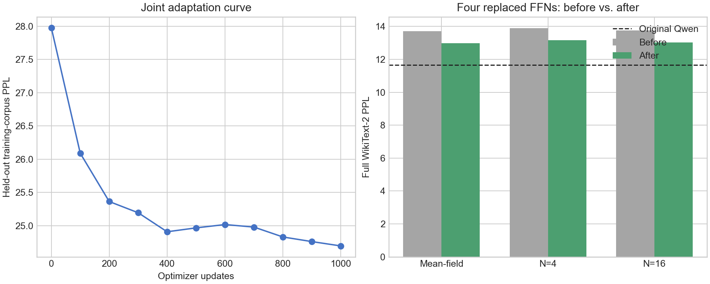

# Joint end-to-end adaptation of four full-path P-DNN FFNs

This experiment jointly adapts decoder FFNs 10, 11, 12, and 13 after inserting
their independently distilled full-path bipolar P-DNN checkpoints into
Qwen2.5-0.5B. It tests whether the multi-layer degradation comes from training
each student only on original-Qwen inputs.

## Method

The original Qwen model is a frozen teacher. A second frozen Qwen model has
four FFNs replaced by trainable P-DNN students. All original attention,
normalization, embedding, output-head, and remaining FFN parameters stay
frozen. Only the 34,888,192 parameters in the four P-DNN modules are updated.

Each training sequence is sent through both complete models. The student uses
four independent hard bipolar paths in every replaced FFN. The existing STE
passes the backward gradient through the corresponding tanh means. The loss is

```text
0.8 * KL(original-Qwen logits || joint-P-DNN logits)
  + 0.2 * next-token cross entropy
```

The KL temperature is 1.0. This is separate from the p-bit input temperature
0.25 and hidden temperature 1.0.

Training configuration:

| Setting | Value |
| --- | ---: |
| Optimizer updates | 1,000 |
| Sequence length | 256 |
| Micro-batch | 1 |
| Gradient accumulation | 4 |
| Effective tokens/update | 1,024 |
| Learning rate | 1e-5 |
| Schedule | 50-step warm-up, cosine decay |
| Weight decay | 0.01 |
| Maximum gradient norm | 1.0 |
| Training sample count | 4 |
| Held-out training tokens | 65,536 |

The final 65,536 WikiText-2 training tokens are excluded from optimization and
used for checkpoint selection. The full standard WikiText-2 test set is used
only after training.

## Cost on one RTX 5090

| Measurement | Result |
| --- | ---: |
| Wall time | **225.18 s (3 min 45 s)** |
| Effective throughput | 4,547.55 tokens/s |
| Peak allocated memory | **4,007,941,120 bytes (3.73 GiB)** |
| Trainable parameters | 34,888,192 |

The measured optimizer update took about 0.21–0.25 seconds after model loading.
Joint training is much more expensive per update than local FFN regression,
but it is still a few-minute experiment for this four-layer, 0.5B model.

## Held-out training curve

| Step | PPL |
| ---: | ---: |
| 0 | 27.978359 |
| 100 | 26.089407 |
| 200 | 25.363578 |
| 300 | 25.194894 |
| 400 | 24.908692 |
| 500 | 24.967337 |
| 600 | 25.017305 |
| 700 | 24.979077 |
| 800 | 24.830364 |
| 900 | 24.760916 |
| 1,000 | **24.695601** |

The best checkpoint is the final step. The curve continues to improve slowly,
so a longer or better-tuned run may recover more quality.

## Full WikiText-2 test perplexity

The before values use the same four layers `{10,11,12,13}` and the same
independently distilled source checkpoints.

| Inference mode | Before joint training | After joint training | Improvement |
| --- | ---: | ---: | ---: |
| Mean-field, seed 0 | 13.715394 | **12.985907** | -0.729487 |
| N=4, 3-seed mean | 13.895320 ± 0.001680 | **13.153481 ± 0.001378** | -0.741839 |
| N=16, seed 0 | 13.758046 | **13.035125** | -0.722920 |

Original Qwen PPL is 11.652735. At N=4, joint adaptation reduces the P-DNN
model's relative increase from 19.25% to 12.88%. It recovers **31.17% of the
excess negative log-likelihood** introduced by the four independent students.

The improvement is almost identical for mean-field, N=4, and N=16. Joint
training therefore corrects deterministic composition and distribution-shift
error rather than merely reducing sampling variance. The remaining gap in
mean-field PPL shows that sampling count is still not the primary limitation.



## Decision

Joint end-to-end adaptation is effective and inexpensive enough to continue.
The next controlled experiment should extend the same method to the six safest
layers `{9,10,11,12,13,14}`. A second useful comparison is a longer four-layer
run or a loss-weight sweep, because the validation curve has not saturated.

## Checkpoint identities

The compatible individual checkpoints remain on the experiment server. Each
is 34,892,623 bytes and can be passed directly to the existing multi-layer PPL
evaluator.

| Layer | SHA-256 |
| ---: | --- |
| 10 | `cea8d0564d586cc0da3cd40acac4fbff9c0c9b4ed81c069d1533af19622e4fe2` |
| 11 | `96ca6b148e7e3da3e3c3b19983fb97100b48552f836b94603952503880ef0cf5` |
| 12 | `d8e4dfb35e40983dd37858ceab10ae0d98406bccc2539736105064938e9f0255` |
| 13 | `4f80649ec655fa93d2a454b8058d78feffa2787b13419ac89460ebeed3c6ef0b` |
