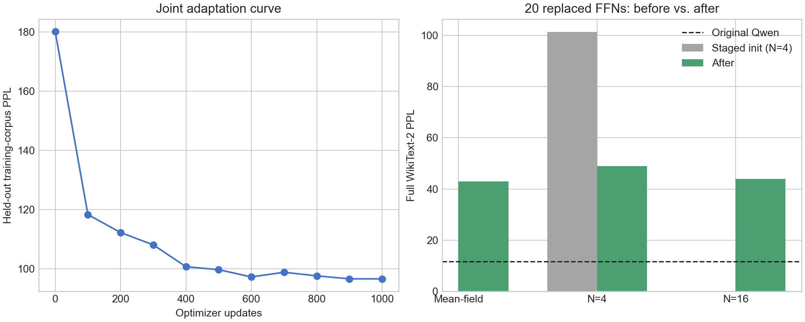

# Joint end-to-end adaptation of twenty full-path P-DNN FFNs

This experiment jointly adapts the twenty least-sensitive decoder FFNs from
the earlier single-layer screen:
`{1,4,5,6,7,8,9,10,11,12,13,14,15,16,17,18,19,20,21,22}`.
Layers 0, 2, 3, and 23 remain as original Qwen FFNs.

## Initialization and method

The ten layers `{7,8,9,10,11,12,13,14,15,18}` start from the best
checkpoints of the ten-layer joint run. The other ten layers start from their
independently distilled checkpoints. This staged twenty-layer model has N=4
seed-0 PPL 101.374861 before any new joint update. For context, twenty
independently distilled students previously produced N=4 seed-0 PPL
166.089720.

The original Qwen model is a frozen teacher. Only the 174,440,960 parameters
inside the twenty P-DNN modules are updated. Each replaced FFN executes four
hard bipolar paths and uses the tanh-mean straight-through estimator.

```text
loss = 0.8 * KL(original-Qwen logits || joint-P-DNN logits)
     + 0.2 * next-token cross entropy
```

The run uses sequence length 256, micro-batch 1, gradient accumulation 4,
1,000 optimizer updates, learning rate 1e-5, 50-step warm-up, cosine decay,
weight decay 0.01, and maximum gradient norm 1.0. The final 65,536 WikiText-2
training tokens are excluded from optimization and used for checkpoint
selection.

## Cost on one RTX 5090

| Measurement | Result |
| --- | ---: |
| Wall time | **439.34 s (7 min 19 s)** |
| Effective throughput | 2,330.78 tokens/s |
| Peak allocated memory | **6,468,483,072 bytes (6.02 GiB)** |
| Trainable parameters | 174,440,960 |
| Best checkpoint | Step 1,000 |

The run fits comfortably on one 32 GB RTX 5090. Compute and memory are not the
limiting factors for this test; model quality is.

## Held-out training curve

| Step | PPL |
| ---: | ---: |
| 0 | 180.198305 |
| 100 | 118.272290 |
| 200 | 112.177763 |
| 300 | 108.027923 |
| 400 | 100.640876 |
| 500 | 99.630302 |
| 600 | 97.183830 |
| 700 | 98.755262 |
| 800 | 97.546944 |
| 900 | 96.531741 |
| 1,000 | **96.531263** |

Most of the recovery occurs in the first 400–600 steps. The curve is nearly
flat by step 900, so simply extending the same schedule is unlikely to close
the remaining gap.

## Full WikiText-2 test perplexity

| Inference mode | Result |
| --- | ---: |
| Mean-field, seed 0 | **42.881774** |
| N=4, seed 0 | 48.956228 |
| N=4, seed 1 | 48.776949 |
| N=4, seed 2 | 48.999265 |
| N=4, 3-seed mean | **48.910814 ± 0.096274** |
| N=16, seed 0 | **43.840279** |

For the directly comparable seed-0 N=4 path:

| Stage | PPL |
| --- | ---: |
| Twenty independent students | 166.089720 |
| Ten-layer joint checkpoints plus ten independent students | 101.374861 |
| Twenty-layer joint training | **48.956228** |

Relative to twenty independent students, joint training recovers 45.98% of
the excess negative log-likelihood. Relative to the actual staged
initialization, this run recovers 33.65%.

The improvement is large, but original Qwen PPL is 11.652735 and the
twenty-layer N=4 mean remains **319.7% higher**. Mean-field PPL is already
42.88, while N=16 only reduces the result to 43.84. Therefore sampling noise
is not the primary limitation; the stacked P-DNN approximation has a large
deterministic structural and distribution-shift error.



## Decision

The predicted failure at twenty layers is confirmed. Joint training prevents
the catastrophic PPL near 100–166, but it does not make twenty replacements
acceptable. Further layer expansion should stop. The next useful experiment
should change the model or objective: preserve more continuous residual
information, add intermediate hidden-state matching, increase P-DNN capacity,
or use progressive layer addition with rehearsal after each stage. A longer
run with the same objective is a low-priority control because validation has
already plateaued.

## Checkpoint identities

The twenty checkpoints total about 666 MiB and remain on the experiment
server.

| Layer | Bytes | SHA-256 |
| ---: | ---: | --- |
| 1 | 34,893,765 | `05aec8a47bd55b14d77006c01c32820d1b14f71827b980cebecf76400b2220dc` |
| 4 | 34,893,765 | `91de63a20e6be59187275871ac85a7542017f6b1bc64a68017b66e0839049c48` |
| 5 | 34,893,765 | `3d06843b331e531e6d77d8c05458ba0caccd1b954d7454941759440414c8c407` |
| 6 | 34,893,765 | `c2ebc7601f4da029406892e70c72714b63ce0a30fb4acb48ec67fba6c4948dfb` |
| 7 | 34,893,765 | `7eca2b87313181bacff7fbb8a784a9b1f942300fa352402c2b49af229f8f7097` |
| 8 | 34,893,765 | `56eaa3a6552839ddd33f5f3a4583e806bcba90eedfabf03e6315e6ff3a73962e` |
| 9 | 34,893,765 | `946a6430ea0f38681e462f0cf3afce8f1c7db126ccb2b4b44dbf4124422768aa` |
| 10 | 34,893,775 | `9c5c01c96d1333731ad699a1086b0869e5063247bf6cf06838db65e57c14d9a7` |
| 11 | 34,893,775 | `8e1185c221955930581b329fa99b8ed77a970ed13731c29a84fcb5954e3c8e62` |
| 12 | 34,893,775 | `a12cfa7e1e4542911b751fe248e11b619c73c5ce1020f6fa207c5eb958472f37` |
| 13 | 34,893,775 | `090c117d00f3de0bc96d37bea685d66eb0858a98f3cf2492db699cd2df1a2d55` |
| 14 | 34,893,775 | `e609236c9a26f6a9794a916d0975ca801f03f93c8f8ccaf52879e68088a73b98` |
| 15 | 34,893,775 | `bcdb1a35e6bebc07cca303d49188f382ea158fcbf256f3ee0f3b9a12c2348325` |
| 16 | 34,893,775 | `b1b26202892fad2f6a80ca047e15b92a4b0aca64f2ef062fcbfa08e6844e62ff` |
| 17 | 34,893,775 | `f79f82208c61e294ed1ae06d8a5da0e8bf04dc785dd394409a79ae4046c3179b` |
| 18 | 34,893,775 | `5598e6fe432f45f1dc40d19ac3258d99a152550a4674f43eca5b51c225dbf2d4` |
| 19 | 34,893,775 | `e61dc4a5c394ad3c948a5b236568c756342ad4d8ad15fbf1bbe6cef6086528fa` |
| 20 | 34,893,775 | `798ebae6a9d01711277e31cbb11c189dacd5676b14cf1fe972940ca036689da1` |
| 21 | 34,893,775 | `0d983aea00541ff24b07af8179440c244c59290c75da501ed56133f6583097e7` |
| 22 | 34,893,775 | `4b838e81086abf14932738ecbf895d5e76f7ab6a15e4c0e43b5dc502d86fe4fc` |
