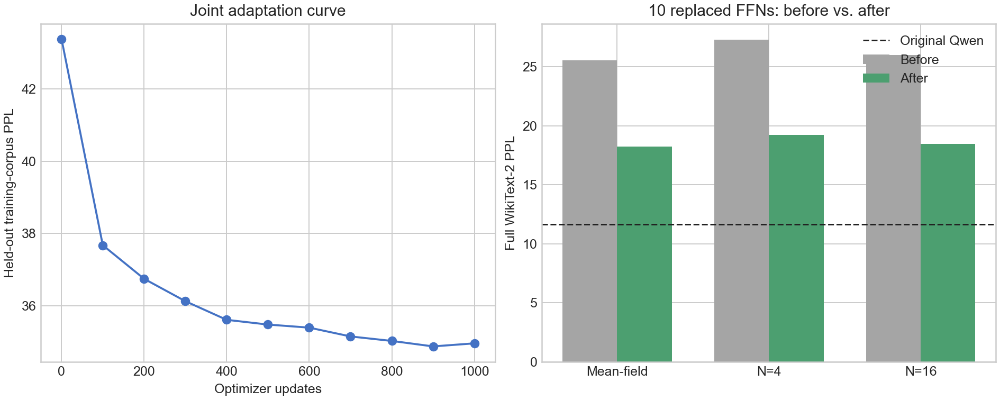

# Joint end-to-end adaptation of ten full-path P-DNN FFNs

This experiment jointly adapts decoder FFNs
`{7,8,9,10,11,12,13,14,15,18}`, the ten safest layers from the earlier
single-layer screen. It directly tests whether end-to-end training can arrest
the rapid quality loss observed when independently distilled students are
composed.

## Initialization and method

The initialization is staged. Layers 10–13 start from the best checkpoints of
the four-layer joint run; layers 7, 8, 9, 14, 15, and 18 start from their
independently distilled checkpoints. Before any ten-layer update, this hybrid
initialization has N=4 seed-0 PPL 24.813126. The comparable ten-layer model
using ten independent checkpoints has N=4 PPL 27.305092 ± 0.021530.

The original Qwen model is a frozen teacher. A second frozen Qwen model has ten
FFNs replaced by trainable P-DNN students. Only the 87,220,480 parameters in
those students are updated. Every replaced FFN executes four independent hard
bipolar paths and uses the tanh-mean straight-through estimator during
backpropagation.

The final vocabulary loss is

```text
0.8 * KL(original-Qwen logits || joint-P-DNN logits)
  + 0.2 * next-token cross entropy
```

Training configuration:

| Setting | Value |
| --- | ---: |
| Optimizer updates | 1,000 |
| Sequence length | 256 |
| Micro-batch | 1 |
| Gradient accumulation | 4 |
| Effective tokens/update | 1,024 |
| Learning rate | 1e-5 |
| Schedule | 50-step warm-up, cosine decay |
| Weight decay | 0.01 |
| Maximum gradient norm | 1.0 |
| Training sample count | 4 |
| Held-out training tokens | 65,536 |

The final 65,536 WikiText-2 training tokens are excluded from optimization and
used for checkpoint selection. The standard WikiText-2 test set is evaluated
only after training.

## Cost on one RTX 5090

| Measurement | Result |
| --- | ---: |
| Wall time | **316.15 s (5 min 16 s)** |
| Effective throughput | 3,238.99 tokens/s |
| Peak allocated memory | **4,928,147,456 bytes (4.59 GiB)** |
| Trainable parameters | 87,220,480 |

This run fits easily on one 32 GB RTX 5090. Increasing from four to ten
replaced FFNs raises measured training time by about 40% and peak allocated
memory by about 0.86 GiB.

## Held-out training curve

| Step | PPL |
| ---: | ---: |
| 0 | 43.376873 |
| 100 | 37.674717 |
| 200 | 36.747608 |
| 300 | 36.128363 |
| 400 | 35.614067 |
| 500 | 35.483029 |
| 600 | 35.398146 |
| 700 | 35.154724 |
| 800 | 35.030578 |
| 900 | **34.879660** |
| 1,000 | 34.963803 |

Step 900 is selected as the best checkpoint. The small regression at step
1,000 supports validation-based selection rather than always keeping the final
update.

## Full WikiText-2 test perplexity

The “independent” values use ten independently distilled students. The hybrid
seed-0 value measures the actual staged initialization used by this run.

| Inference mode | Ten independent | After joint training | Improvement |
| --- | ---: | ---: | ---: |
| Mean-field, seed 0 | 25.547497 | **18.253278** | -7.294219 |
| N=4, 3-seed mean | 27.305092 ± 0.021530 | **19.226073 ± 0.006941** | -8.079019 |
| N=16, seed 0 | 26.018616 | **18.488546** | -7.530070 |

The individual N=4 results after training are 19.223202, 19.235638, and
19.219380 for seeds 0, 1, and 2. The reported uncertainty is the population
standard deviation, matching the earlier result tables.

Original Qwen PPL is 11.652735. At N=4, joint adaptation recovers **41.20% of
the excess negative log-likelihood** relative to the ten-independent baseline.
Relative to the stronger staged seed-0 initialization, N=4 drops from
24.813126 to 19.223202 and recovers 33.75% of its excess NLL.

Mean-field and N=16 improve by comparable amounts. The dominant benefit again
comes from correcting composition and upstream distribution shift, while
sampling variance is very small. The remaining mean-field PPL of 18.253278
also shows that the residual gap is structural and cannot be removed by
increasing the number of samples alone.



## Decision

Ten-layer joint training changes the experiment from rapid collapse to a
partially usable model, but PPL 19.23 is still 65.0% above original Qwen. The
next experiment should keep this ten-layer set fixed and improve the objective
or capacity before adding more layers. Useful controlled tests are a longer
low-learning-rate continuation, intermediate hidden-state matching, and a
small KL/CE-weight sweep. Expanding beyond ten layers now would confound the
remaining structural error with additional replacement error.

## Checkpoint identities

The checkpoints remain on the experiment server and are omitted from Git
because the ten files total about 333 MiB.

| Layer | Bytes | SHA-256 |
| ---: | ---: | --- |
| 7 | 34,893,061 | `d72c1b082bee01bda497373ff10d4d565fee58b7076ba47a767917a76dcb089c` |
| 8 | 34,893,061 | `e32b2a019f875e5bae805d8898666c97a2ce20b0a967b8afd7acff521e2530f3` |
| 9 | 34,893,061 | `1f138b4ce3d98428a624b7ca564548f4db9f92c851065af0a5e5d8dde3a594d2` |
| 10 | 34,893,071 | `e9b37badfb007ad45bd42bd17a002cb0701d98eb455530244df9e236dcb7f9c3` |
| 11 | 34,893,071 | `11ad770d306ab601c6deb568fd310fe7025105e2245bacfc6519ccd5df038b8d` |
| 12 | 34,893,071 | `74135f80c5ec98b4c2591ccc8b91b72af53f53017e5d17e1cbd341ce30c6c91f` |
| 13 | 34,893,071 | `4b500e6aea330ed6af4edf52a93ffcb219c649b770869f6bb3d93c4c08f00728` |
| 14 | 34,893,071 | `3a8d29047e20d15a028fcc1e0e99460087ed48c839cbcdcd8b809ddd43bfcf81` |
| 15 | 34,893,071 | `d67df893a48423d7f540e76d75d184684b33d83a07ecd07403a4f4044a15cf95` |
| 18 | 34,893,071 | `41a995c6c8c9c240c4f0a85588525098bb49ea74262e3771ec34ece372206e0d` |
