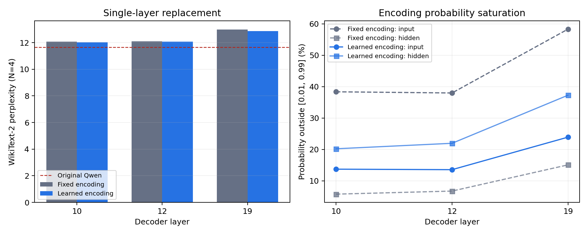

# 分层可学习 0/1 p-bit 编码实验

日期：2026-09-29

## 目的

此前 0/1 P-DNN 使用统一的固定编码：入口温度 `0.125`、矩阵间温度
`0.5`、阈值均为零。这个设置没有考虑不同 Qwen decoder 层的输入分布，
并且入口概率出现明显饱和。本实验让每个被替换的 FFN 分别学习自己的
标量阈值与温度，检查这种编码能否减少单层误差以及多层误差累积。

这里的“分层”是指每个 decoder FFN 有一套独立参数；当前版本在每个
二值化边界只学习一个标量阈值和一个标量温度，还没有细化到逐通道参数。

## 计算方法

对输入 `x` 和第一个矩阵输出 `u`，0/1 概率分别为

```text
p_in = sigmoid((x - theta_in) / T_in)
z_in ~ Bernoulli(p_in)
u = W1 z_in + b1
p_hidden = sigmoid((u - theta_hidden) / T_hidden)
z_hidden ~ Bernoulli(p_hidden)
y_path = W2 z_hidden + b2
```

推理时独立运行 N 条完整二值路径，最后只对 `y_path` 求平均。训练时先做
2,000 步 mean-field 回归，再做 2,000 步 N=4 硬采样训练；硬采样前向保持
严格 0/1，反向使用概率均值的 STE。温度通过
`softplus(raw_temperature) + 0.001` 参数化，始终保持为正。

固定组和可学习组使用相同的 layer、宽度 4,864、数据、初始化温度、训练步数
和随机种子。测试语料是完整 WikiText-2 test，共 299,077 个评分 token。

## 单层结果

原始 Qwen2.5-0.5B 的 PPL 为 11.652735。表中 N=4 是三个推理 seed 的
均值与总体标准差；NMSE 是训练结束时的 N=4 层局部验证结果。

| Layer | 编码 | Mean-field PPL | N=4 PPL | N=16 PPL | N=4 NMSE |
| ---: | --- | ---: | ---: | ---: | ---: |
| 10 | 固定 | 12.024850 | 12.068070 ± 0.001497 | 12.039323 | 0.558799 |
| 10 | 可学习 | **11.978528** | **12.029378 ± 0.000756** | **12.000743** | **0.527137** |
| 12 | 固定 | 12.054641 | 12.093255 ± 0.002060 | 12.066037 | 0.558282 |
| 12 | 可学习 | **12.019371** | **12.067226 ± 0.001875** | **12.037908** | **0.523683** |
| 19 | 固定 | 12.889377 | 12.982830 ± 0.001694 | 12.918155 | 0.483547 |
| 19 | 可学习 | **12.754811** | **12.870613 ± 0.001061** | **12.800488** | **0.448181** |

三个层的 N=4 PPL 分别改善 0.038692、0.026028 和 0.112217。layer 19
更敏感，也得到最大的绝对收益。三个推理 seed 的波动都远小于组间差异。

## 学到的编码和饱和度

“饱和”定义为 0/1 概率小于 0.01 或大于 0.99。统计使用训练语料保留区的
8 × 2 × 256 个入口状态；隐藏层统计还包含四条独立采样路径。

| Layer | 编码 | `T_in` | `theta_in` | 入口饱和 | `T_hidden` | `theta_hidden` | 隐藏饱和 |
| ---: | --- | ---: | ---: | ---: | ---: | ---: | ---: |
| 10 | 固定 | 0.125000 | 0 | 38.356% | 0.500000 | 0 | 5.758% |
| 10 | 可学习 | 0.228394 | -0.002954 | **13.709%** | 0.290993 | 0.014296 | 20.207% |
| 12 | 固定 | 0.125000 | 0 | 37.982% | 0.500000 | 0 | 6.735% |
| 12 | 可学习 | 0.225456 | -0.006585 | **13.554%** | 0.287447 | 0.013015 | 21.955% |
| 19 | 固定 | 0.125000 | 0 | 58.312% | 0.500000 | 0 | 15.087% |
| 19 | 可学习 | 0.282942 | -0.014044 | **23.910%** | 0.271827 | 0.031185 | 37.269% |

优化器在三个层都做出相同选择：提高入口温度以保留输入的不确定性，同时降低
隐藏温度，使矩阵后的编码更确定。它不是简单地让所有概率远离饱和，而是把
信息压缩从 FFN 入口重新分配到矩阵之间。入口饱和度下降约 24–34 个百分点，
同时局部 NMSE 和完整模型 PPL 都改善。



## 三层组合结果

为了检验收益能否在多层同时替换时保留，把 layer 10、12、19 的三个独立
student 同时装入 Qwen。这个实验没有做三层联合训练。

| 推理模式 | 固定编码 | 分层可学习编码 | 改善 |
| --- | ---: | ---: | ---: |
| Mean-field，seed 0 | 13.887425 | **13.629576** | -0.257849 |
| N=4，3 seeds | 14.092550 ± 0.003155 | **13.890275 ± 0.001576** | -0.202275 |
| N=16，seed 0 | 13.958212 | **13.741193** | -0.217019 |

N=4 PPL 相对降低 1.44%，恢复了这三层固定编码相对原模型所增加 NLL 的
7.60%。N=4、N=16 和 mean-field 都改善，说明收益来自更合适的确定性编码
函数，而不是偶然的采样方差变化。改善仍然不足以解决深层堆叠问题；它应当
作为后续十层联合训练的初始化和可训练参数，而不能替代联合训练。

## 成本与局限

每个 student 只增加四个标量参数。固定组单层训练用时 71.7–73.4 秒，
可学习组为 85.1–85.5 秒；allocated 显存从约 1.271 GB 增至 1.328 GB。
额外时间主要来自对温度、阈值反向传播及本次实现路径，参数量本身可以忽略。

当前结论来自三个代表层、每个条件一个训练 seed。三个推理 seed 能确认采样
稳定性，但不能估计训练初始化方差。下一步应在十层集合
`{7,8,9,10,11,12,13,14,15,18}` 上让所有层的编码参数随最终 logits
联合训练；若收益仍不够，再比较逐通道阈值/温度，避免直接增加矩阵深度或宽度。

## Checkpoint 身份

大 checkpoint 保留在远程服务器，没有提交到 Git。下面给出可复现实验身份。

| Checkpoint | 字节数 | SHA-256 |
| --- | ---: | --- |
| `layer10_fixed/student_sampled.pt` | 104,671,651 | `b97d974ae282b0a740625379db8198f14e5761a575d080ae28e9f6118fb8cf51` |
| `layer10_learnable/student_sampled.pt` | 104,675,955 | `1910d78a34d0457ca4e3e7a72c00bf6e7365273e456912e3bafc6069b0596ae2` |
| `layer12_fixed/student_sampled.pt` | 104,671,651 | `84e9b636b2e35d4b15566f7d90c44c62dc01eadc4db42e220f582c8eea6500f8` |
| `layer12_learnable/student_sampled.pt` | 104,675,955 | `10dc7dbc43e1ccaa134516c85a8b5a9e9a5ad524d547a6835c7c68c3cdcab408` |
| `layer19_fixed/student_sampled.pt` | 104,671,651 | `a86564af3e63d16a789f5148d32a42c4a326b65e4e83f43666b9d0b3e7e6e696` |
| `layer19_learnable/student_sampled.pt` | 104,675,955 | `c3983678c1d1045636081c9955c19f54e2d5e3bd1e0b30757026120e53ce953e` |

目录中的 JSON 和 JSONL 是原始训练、饱和度与 PPL 数据。远程绝对路径已替换为
`<PBIT_LLM_ROOT>`，不影响数值内容。
