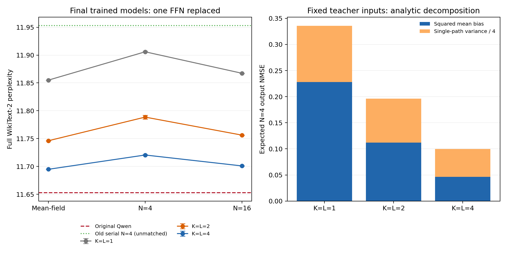
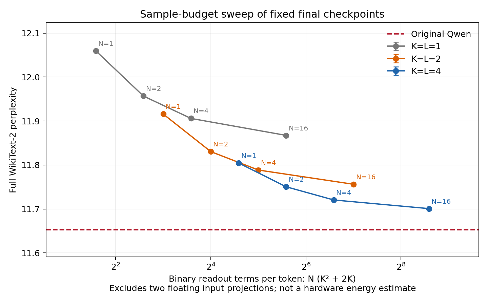
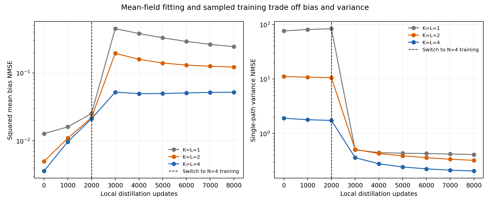

# 双分支多阈值p-bit与AND读出：第12层试验（2026-10-02）

## 实现与边界

本轮只替换Qwen2.5-0.5B Base的decoder layer12。gate/up投影维度均为896→4864，
从原Qwen权重初始化，输出4864→896也从原权重初始化；之后全部参与局部蒸馏。
投影及输出偏置保留且初始为0。入口保持浮点，不做入口量化。

每通道a、u各驱动K个独立0/1 p-bit：p_k=sigmoid((a/scale-theta_k)/T_k)。
每条分支由offset与带正负系数的bit和表示，分别拟合SiLU(a)和u。两条分支
的随机源条件独立，AND组合复用同一条路径的bit，不能每个AND另行重采样。
阈值由驱动偏置实现，温度下限为归一化场单位下的0.02，不要求器件独立阈值端口。

展开(s0+sum c_k B_k)(v0+sum d_l C_l)后，包含常数项、K+K个单bit项和K²个
AND项。固定解码系数合并进共享Wd的列缩放，常数并入输出偏置。实际采样PPL
使用展开后的二值输入读出，最终才平均N条完整路径；不会先还原连续分支再做乘法。

训练使用数学等价的因式分解形式加速GPU，已用测试验证前向与STE梯度等价。
门控概率及读出/路径累加为FP32，主模型、输入投影与FFN最终输出为BF16。
浮点数舍入使两种实现并非逐位相同，实际差异另在moments记录。

## 训练与评估协议

K=1、2、4三组宽度、初始化来源和训练日程一致。每组先用训练集32768 token
校准每通道|a|、|u|的99.5%分位数作为固定尺度（没有显式裁剪），再拟合分支500步。
之后2000步mean-field预热、6000步N=4采样蒸馏，batch4、seq256，学习率3e-4/1e-4，
损失为NMSE+0.05余弦损失。其余Qwen参数冻结，训练seed0。

初始分支拟合以SiLU(a)与u为目标；后续蒸馏只约束最终FFN输出，投影、读出和编码器
可共同适配，因此最终分支不保证仍等于原SiLU/线性函数。诊断中的branch NMSE以
学生当前投影场为参照，不应误读为对原教师通道的保真度。

验证/诊断只用训练集末65536 token；校准、拟合和蒸馏均排除该尾部。固定评估分支拟合后、
2000步预热后、6000步采样后三个checkpoint，不用test选择checkpoint。完整test为299078
token，计分299077，上下文2048、stride1024。主试验最终N=4取三个推理seed；其余单seed。

## 完整模型PPL

原始Qwen：**11.652735**。

| 每分支K | 阶段 | Mean-field | N=4 | N=16 |
| ---: | --- | ---: | ---: | ---: |
| 1 | 分支拟合后 | 11.666421 | 45.252955 | — |
| 1 | 2000步mean-field后 | 11.675839 | 53.148322 | — |
| 1 | 6000步采样后 | 11.855036 | 11.905924 ± 0.001288 | 11.867358 |
| 2 | 分支拟合后 | 11.657459 | 13.464102 | — |
| 2 | 2000步mean-field后 | 11.669036 | 13.367298 | — |
| 2 | 6000步采样后 | 11.746116 | 11.788584 ± 0.003538 | 11.756218 |
| 4 | 分支拟合后 | 11.657118 | 11.922366 | — |
| 4 | 2000步mean-field后 | 11.671707 | 11.909761 | — |
| 4 | 6000步采样后 | 11.694797 | 11.720476 ± 0.000883 | 11.700873 |

## 补充：降低采样次数

主试验完成后，为回答二值读出成本问题，对三组固定最终checkpoint补测N=1/2，
各用三个推理seed，共18次完整test；没有续训或根据test更换checkpoint。

| 每分支K | N=1 PPL | N=2 PPL | N=4 PPL | N=16 PPL |
| ---: | ---: | ---: | ---: | ---: |
| 1 | 12.059565 ± 0.002525 | 11.956807 ± 0.002330 | 11.905924 ± 0.001288 | 11.867358 |
| 2 | 11.915956 ± 0.000720 | 11.830503 ± 0.001293 | 11.788584 ± 0.003538 | 11.756218 |
| 4 | 11.804619 ± 0.001479 | 11.750483 ± 0.001256 | 11.720476 ± 0.000883 | 11.700873 |

±是三个推理seed的总体标准差，不是多个训练seed的置信区间。

## 结果判断

固定N=4，K=1→2→4的PPL为11.905924→11.788584→11.720476。
K=4比原模型高0.581%，相对K=1减少73.24%的超额PPL差距。
K=1→4只增加约0.67%的参数，但每路径二值读出项由3增加到24；质量收益
支持多阈值分支表示，但不能推导出能效收益。

按动态二值读出项计数，K=4,N=2和K=1,N=16均为48项，PPL分别11.750483与11.867358。
本轮更多编码位比单纯增加重复采样更有效；该计数不包含驱动、连线、权重访问
差异，不能当成同能耗比较。

分支拟合后，K=4 mean-field已经达到11.657118，接近原模型；此时实际N=4为
11.922366。采样训练使实际N=4降至11.720476，但mean-field变为11.694797。
这表明本轮重要限制是低采样预算下的偏差/方差折中，而非分支平均函数完全不能
拟合SwiGLU。K=1拟合后mean-field同样接近原模型，却有N=4 PPL45.252955，
进一步说明只看均值拟合会误判部署质量。

2000步mean-field预热未改善拟合后checkpoint的完整PPL；局部训练目标和全模型
性能并不完全一致，后续可以比较跳过预热或使用解析偏差/方差目标，但本轮未执行。
最终K=4的均值偏差NMSE与方差/4贡献接近，今后应同时优化两者。

## 固定输入偏差和方差

诊断使用1024个保留的teacher输入token。固定输入下的两个分支独立，
Var(SV)=Var(S)Var(V)+Var(S)E[V]²+Var(V)E[S]²；输出方差由Wd列平方加权。
该解析式保留共享bit使AND项相关的影响。均值偏差与方差/4之和是实数算术下的
精确条件N=4输出NMSE，不是PPL分解。另用128条路径验证解析方差。

| K | 阶段 | 均值偏差NMSE | 单路径方差NMSE | 预测N=4 NMSE |
| ---: | --- | ---: | ---: | ---: |
| 1 | 分支拟合后 | 0.012647 | 79.496260 | 19.886712 |
| 1 | 2000步mean-field后 | 0.024503 | 87.159254 | 21.814316 |
| 1 | 6000步采样后 | 0.227851 | 0.430453 | 0.335464 |
| 2 | 分支拟合后 | 0.005187 | 11.526940 | 2.886922 |
| 2 | 2000步mean-field后 | 0.021357 | 11.010613 | 2.774011 |
| 2 | 6000步采样后 | 0.112171 | 0.335486 | 0.196042 |
| 4 | 分支拟合后 | 0.003876 | 1.980305 | 0.498952 |
| 4 | 2000步mean-field后 | 0.020046 | 1.799464 | 0.469912 |
| 4 | 6000步采样后 | 0.046629 | 0.211889 | 0.099601 |

## 成本与对照范围

| K | 参数数 | 分支拟合及校准秒数 | 蒸馏秒数 | 峰值GiB | 每路径二值读出项 |
| ---: | ---: | ---: | ---: | ---: | ---: |
| 1 | 13,123,968 | 2.09 | 161.48 | 9.30 | 3 |
| 2 | 13,153,152 | 2.48 | 161.70 | 9.30 | 8 |
| 4 | 13,211,520 | 2.11 | 216.25 | 9.30 | 24 |

历史浮点入口串联模型单层N=4 seed0为11.953123，仅作背景参考：
它是两矩阵8.72M参数、随机初始化、BF16读出，本轮为三矩阵约13M参数、教师初始化、
额外分支拟合及FP32读出，不能将二者差异单独归因于AND结构。K=1/2/4才是本轮
主要受控比较，bank参数量随K略增。

K=2/4每路径分别8/24组二值读出项，N=4分别32/96组；此外有两次浮点入口投影，
可在各采样路径间复用。参数共享不等于权重读取、连接及累加免费。本轮没有测量
物理p-bit硬件能耗/延迟，FP32累加和驱动精度也未量化。

只有一个训练seed、一个层与一个语料，不能外推20层效果或架构极限。

## 文件

实现：`experiments/pdnn_ffn/multithreshold_and_ffn.py`；入口：`run_multithreshold_and.py`。
权重位于远程 `/home/Hongjie_Zeng/pbit_llm/results/multithreshold_and_layer12_20261002/`。
本地保存评估、日志元数据、源文件及checkpoint哈希，权重不纳入Git。
