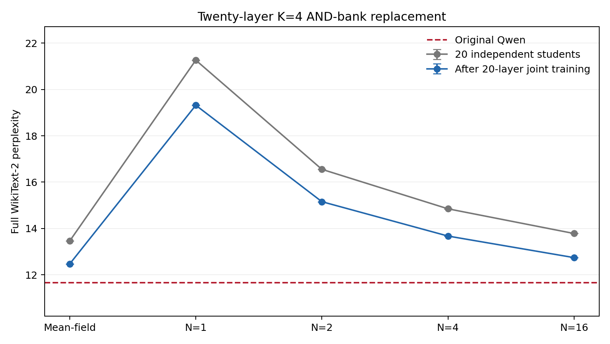
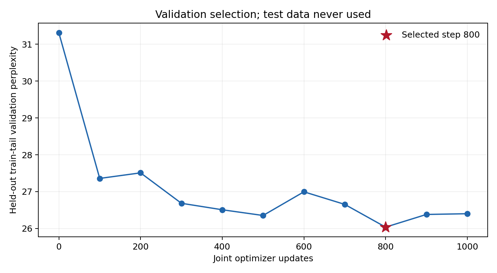

# 二十层四bit双分支AND替换（2026-10-02）

## 实现与协议

替换层：`{1,4,5,6,7,8,9,10,11,12,13,14,15,16,17,18,19,20,21,22}`。
保留原始0、2、3、23层FFN，与上一轮二十层试验相同。每条gate/value分支有4个
线性场驱动的sigmoid p-bit，宽度4864，共享原Qwen初始化的gate/up/down矩阵。
入口保持浮点；输出端展开为8组单bit项与16组AND项，常数折叠为偏置。
输出读出矩阵仅接收0/1，最后平均N条路径；驱动偏置、温度和带符号解码系数可学习。

第12层复用上一轮K=4最终checkpoint并核对SHA256，其余19层按完全相同的500步
分支拟合、2000步mean-field、6000步N=4局部蒸馏训练。校准及训练排除训练尾部
65536 token，校准规模32768 token。矩阵偏置保留，未修改原单层实现。

先将20个独立训练学生直接组合，然后从该状态联合训练1000步；没有继承此前十层
联合模型。每步1024 token（microbatch1、seq256、累积4），学习率峰值1e-5，
50步warm-up后余弦衰减，损失0.8教师logit KL+0.2 next-token CE。只更新替换FFN，
其余Qwen参数冻结。每100步在保留训练尾部评估，按验证PPL选择最佳checkpoint。

训练与验证使用已验证代数等价的因式分解采样形式；全部N>0正式test使用AND展开
的二值输入读出。BF16主模型与入口投影，FP32概率bank、读出及路径累加，最终FFN
输出为BF16。有限精度下两种读出并非逐位相同，不能把训练GPU速度当成硬件速度。

完整WikiText-2 test共299078 token，计分299077，上下文2048、stride1024。
N=4用三个推理seed，其他各一个；训练seed只有0，test不参与checkpoint选择。

## 完整PPL结果

原始Qwen：**11.652735**。

| 阶段 | Mean-field | N=1 | N=2 | N=4（三推理seed） | N=16 |
| --- | ---: | ---: | ---: | ---: | ---: |
| 20层独立组合 | 13.460670 | 21.265432 | 16.553054 | 14.849078 ± 0.013730 | 13.782845 |
| 20层联合后 | 12.469567 | 19.319311 | 15.156431 | 13.672837 ± 0.002889 | 12.741809 |

## 结果判断

独立组合N=4为14.849078，联合后13.672837；
联合训练恢复其相对原模型超额NLL的34.05%。
单层多bit收益没有在20层组合时完全消失，但仍有显著跨层累积损失。

联合模型N=1/2/4/16分别为19.319311、15.156431、
13.672837、12.741809，mean-field为12.469567。
这些是固定同一checkpoint的推理预算比较，可用来观察增加平均次数的收益；
有限次完整PPL差值不能精确分解成结构偏差与采样方差。

最佳保留验证点在第800步，后段验证结果有波动。训练只有一个seed，
不据此认定达到架构上限，也不据一个语料推断所有下游任务表现。

±为推理seed的总体标准差，不是训练置信区间。

## 与历史试验的关系

| 二十层联合模型 | N=4 PPL |
| --- | ---: |
| 历史sigmoid入口串联 | 38.764105 |
| 历史浮点入口串联 | 27.127764 |
| 本轮四bit双分支AND | 13.672837 |

历史结果仅作实际效果参考。此前浮点串联为两矩阵、20层174,440,980参数，随机初始化、
BF16读出，且部分层继承十层联合适配。本轮为三矩阵、20层264,230,400参数，教师
初始化、分支拟合、FP32读出，联合直接从独立组合开始。替换参数量约增加51.47%，
不能把全部差异单独归因于AND结构。相比原Qwen同20个FFN的261,488,640个参数，
本轮替换部分约增加1.05%。

本轮联合训练使N=4 PPL下降7.92%，
最终仍比原Qwen高17.34%。mean-field不是
有限N完整随机模型输出的精确总体期望，也不是PPL性能下界。需要区分有限N期望与
N→∞极限：本结构入口连续、两bank条件独立，每个FFN内部先平均再传给下一层；
在理想实数算术下，增加每层独立路径数会逐层趋向mean-field网络。实际有限精度
累加和有限N不具备精确等式。含额外入口采样等多重内部非线性的旧结构不自动满足此条件。

## 训练成本与局部验证

20层联合训练：534.06秒，峰值12.58GiB，
最佳验证步800/1000，最佳验证PPL26.036750。
这些时间只包含联合阶段，局部训练分散在多张卡，每个训练任务单卡运行。

本轮新训练19层的局部训练计时合计65.18 GPU分钟，
另有校准、分支拟合、模型加载和评估成本；第12层复用已有训练结果。

| Layer | 局部训练秒数 | 保留集均值偏差NMSE | 保留集方差NMSE/4 |
| ---: | ---: | ---: | ---: |
| 1 | 210.66 | 0.066258 | 0.053187 |
| 4 | 197.08 | 0.067197 | 0.058041 |
| 5 | 209.74 | 0.059780 | 0.047153 |
| 6 | 214.05 | 0.062947 | 0.054142 |
| 7 | 200.07 | 0.051387 | 0.049550 |
| 8 | 201.94 | 0.052787 | 0.050440 |
| 9 | 196.14 | 0.051188 | 0.051457 |
| 10 | 196.52 | 0.052762 | 0.051855 |
| 11 | 214.90 | 0.045656 | 0.045324 |
| 12 | 216.25 | 0.052083 | 0.051438 |
| 13 | 210.47 | 0.049587 | 0.049214 |
| 14 | 220.73 | 0.052735 | 0.051489 |
| 15 | 217.37 | 0.045082 | 0.043525 |
| 16 | 202.30 | 0.040651 | 0.041873 |
| 17 | 201.26 | 0.052828 | 0.050242 |
| 18 | 196.83 | 0.058916 | 0.059147 |
| 19 | 196.37 | 0.045601 | 0.045056 |
| 20 | 220.27 | 0.046990 | 0.042079 |
| 21 | 202.49 | 0.002767 | 0.003605 |
| 22 | 201.72 | 0.047005 | 0.042001 |

以上是固定teacher输入分布下的局部验证，不能直接当作联合模型各层的因果贡献。

## 计算边界与复现

K=4每层每路径24组二值读出，N=4为96组，20层合计1920组；另外还有40次浮点
入口投影。共享参数并不消除连线、权重访问和累加成本，尚未证明专用硬件节能或加速。
驱动、权重与累加器的低精度实现和物理随机相关性也未包含。本轮测试范围仅一个语料。

实现沿用`multithreshold_and_ffn.py`；入口`run_multithreshold_twenty_layer.py`；
联合训练接入`train_joint_multithreshold_and.py`；正式评估`evaluate_multi_layer_multithreshold_and.py`。
原有4项AND数学测试与新增多层梯度/checkpoint集成测试在服务器通过。
新旧评估入口对同一单层检查点、相同seed的4096-token片段给出完全相同PPL。
本地集成测试因未安装transformers未运行，未为此安装额外依赖；本地语法检查通过。

14份完整test结果、40份checkpoint身份和执行源码哈希已核对。
联合训练完成后用finish_multithreshold_twenty_layer.py重叠独立/联合的长N=16评估，
仅替换等待中的调度进程，没有停止训练或评估worker，没有修改checkpoint或评估设置。
权重保留远程`/home/Hongjie_Zeng/pbit_llm/results/multithreshold_and_twenty_layer_20261002/`。
