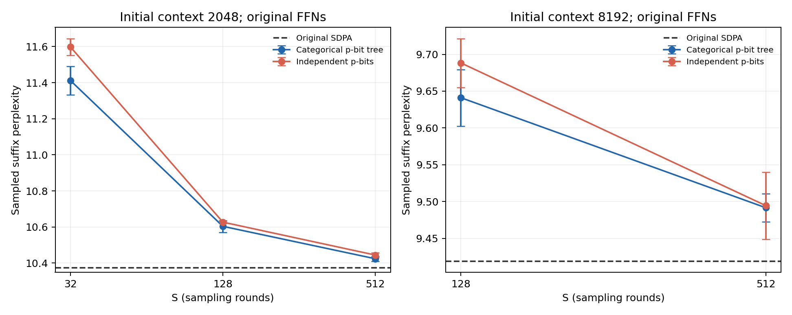

# 原始FFN下的p-bit注意力比较（2026-10-03）

## 结论与范围

两种采样都可在保留原始FFN的条件下近似注意力Value聚合；S增大时本轮误差减小。
这次同时替换24层注意力的AV步骤，不训练、不修改FFN，不近似QK或Softmax。
两种采样均为理想概率可编程p-bit的软件仿真；没有真实器件、驱动误差或随机相关性。
本轮是独立类别采样SANTA，不包含论文S²ANTA的分层/系统采样降方差。

## 两种实现

1. `tree`：对注意力概率构造补零至2的幂的二叉质量树，每个节点按右子树质量/总质量
   做0/1 Bernoulli选择，直到叶子产生一个Value地址。每轮恰好选择一个，重复S轮。
2. `independent`：每个地址独立b_i~Bernoulli(p_i)，重复S轮；输出sum(b_i V_i)/S。
   一轮可能选中零行或多行。除数固定为S，不除以实际选中数。为了加快仿真，用
   C_i~Binomial(S,p_i)直接生成S轮的计数，概率分布与逐轮独立p-bit严格等价。

两种均以FP32计数/S乘Value作线性聚合参考，没有实现真正稀疏gather内核；
线性运算允许合并重复地址，但这里的GPU矩阵仍是密集运算，不代表二值硬件执行。
二叉树用rand<p模拟可编程Bernoulli响应；sigmoid物理p-bit仍需概率到驱动的映射。

## 测试协议

- Qwen2.5-0.5B Base，BF16模型/缓存，FP32分数、Softmax与采样读出。
- 所有24层原始Qwen2MLP对象保留，运行前后权重SHA256一致；不同运行也完全一致。
- 使用WikiText-2 test（299078 token）中均匀选取的互不重叠片段，无训练及参数选择。
- 2k：32段，每段前2047 token精确prefill，然后128个单token缓存解码查询，计分4096个后续token。
- 8k：16段，前8191 token精确prefill，然后128个解码查询，计分2048个后续token。
- 所谓2k/8k表示第一个随机查询的可见上下文为2048/8192，随后上下文随解码增长。
- 解码使用真实后续token进行teacher forcing，保留此前随机层产生的KV缓存。
- 2k和8k的目标位置不同，只在各自表格内部比较。不是完整WT2滑窗PPL，不能与11.652735直接比较。
- 每个随机配置3个推理seed；±为总体标准差，不是跨文本或训练置信区间。
- 首批25项后，因8k单seed方法排序不稳定，补充两seed及8k原始SDPA，共34项评估。

## PPL结果

### 起始上下文2048

原始SDPA：**10.373559**；同精度手写密集参考：**10.376637**。

| S | 二叉p-bit选择树PPL | 独立p-bit PPL | 相对原始PPL增加（树/独立） |
| ---: | ---: | ---: | ---: |
| 32 | 11.411573 ± 0.078925 | 11.597838 ± 0.046969 | 10.01% / 11.80% |
| 128 | 10.603626 ± 0.032546 | 10.626910 ± 0.006513 | 2.22% / 2.44% |
| 512 | 10.423924 ± 0.013483 | 10.444386 ± 0.013397 | 0.49% / 0.68% |

### 起始上下文8192

原始SDPA：**9.418982**；同精度手写密集参考：**9.423515**。

| S | 二叉p-bit选择树PPL | 独立p-bit PPL | 相对原始PPL增加（树/独立） |
| ---: | ---: | ---: | ---: |
| 128 | 9.641071 ± 0.038473 | 9.688321 ± 0.033220 | 2.36% / 2.86% |
| 512 | 9.491615 ± 0.019190 | 9.494489 ± 0.045626 | 0.77% / 0.80% |

两种方案在S=128/512下表现接近，不能根据几个seed的小差异认定其中一种必然优越。
SANTA保持每轮权重和为1；独立p-bit只保证期望权重和为1，会引入随机幅度波动。
这种差异可解释部分误差，但两者方差没有对任意Value成立的统一大小关系。

## 逻辑Value访问与成本

Qwen配置为14个query head、2个KV head，每组共享7个query head。下表统计整个S轮中
非零计数地址在GQA组内的并集，已计入共享KV头；分母是完整Value地址数。
这只是理论可跳过的地址比例，不是实测带宽减少量；缓存行、读取合并和采样器遍历仍有成本。

| 上下文 | 方法 | S | GQA组内不同Value行占比 | 总选中次数均值±标准差 |
| ---: | --- | ---: | ---: | ---: |
| 2048 | tree | 32 | 3.311% | 32.000 ± 0.000 |
| 2048 | independent | 32 | 3.314% | 31.998 ± 4.789 |
| 2048 | tree | 128 | 8.503% | 128.000 ± 0.000 |
| 2048 | independent | 128 | 8.504% | 127.994 ± 9.575 |
| 2048 | tree | 512 | 19.046% | 512.000 ± 0.000 |
| 2048 | independent | 512 | 19.048% | 511.984 ± 19.139 |
| 8192 | tree | 128 | 2.516% | 128.000 ± 0.000 |
| 8192 | independent | 128 | 2.516% | 128.012 ± 9.687 |
| 8192 | tree | 512 | 6.429% | 512.000 ± 0.000 |
| 8192 | independent | 512 | 6.432% | 512.016 ± 19.370 |

随机配置的PyTorch参考解码比原始SDPA慢：树构建/遍历、概率生成及密集读出都有开销。
计时包含统计开销且没有专门预热/重复计时设计，只存作运行记录，不作为硬件速度比较。
Binomial模拟耗时不能当作S轮物理p-bit耗时；独立方案若逐位置逐轮生成，约需L×S个bit，
选择树每个地址约需ceil(log2 L)次条件bit选择，另需构建概率树及寻址。并行度、器件数量
和驱动映射会影响实际成本。尚未证明任一方案加速或节能。

## 验证与文件

40000次抽样检验均值和解析方差、非2次幂树、0/1边界、固定类别计数、独立零/多选、
Binomial与字面p-bit模拟、常数Value保持性质；全部通过。
集成检查确认原始FFN对象保留、prefill逐位一致、SDPA委托逐位一致；FP32密集参考与
原始SDPA存在小的有限精度差别，因此每个上下文都保留两种密集基线。

源码：`experiments/pbit_attention/`；每次运行：`evaluation/`；命令：`commands/`；
原始与追加协议：`protocol.json`、`long_context_repeat_protocol.json`；汇总：`comparison.json`。
执行源码哈希、34次FFN哈希、测试文本与计分位置已核对。

本轮未把已有随机FFN叠加进来，后续组合必须另测，不能直接把两项单独误差相加。
