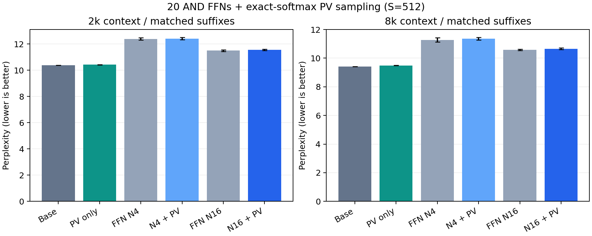

# 20层 AND FFN 与精确 softmax 后 PV 采样的组合评估

实验日期：2026-10-06。48项固定协议评估全部完成，无新增训练。
采用用户确认的20层K=4 AND联合版历史最佳验证检查点（2026-10-02，第800步），保留原始FFN层0、2、3、23。
不是10月5日另一个训练环境中的方差约束检查点，也不声称在所有已有训练seed中重新选出了全局最优。
注意力采用已发布的二叉Bernoulli树，先精确计算QK/softmax，再抽取512个类别样本聚合V；不是Ising或块筛选。

## 评估范围

- FFN在prefill和decode均启用所选配置；注意力仅在decode替换全部24层，prefill注意力保持精确。
- FFN使用展开的0/1单bit和AND读出，最后平均N条路径；N=0为条件均值诊断，不是随机网络精确期望或性能下界。
- FFN与注意力使用分开的随机生成器状态；同一seed的FFN随机流在不同注意力模式间配对。
- 固定WikiText-2后缀：2k为32例/4096个计分token，8k为16例/2048个计分token；不是完整测试集PPL。
- 各上下文目标位置与旧注意力实验一致；batch分别16/4，FFN按256个token分块，所有条件匹配。

## 主要结果

| FFN | 注意力 | seed数 | 2k PPL | 8k PPL |
| --- | --- | ---: | ---: | ---: |
| 原始 | 原始SDPA | 1 | 10.37356 ± 0.00000 | 9.41898 ± 0.00000 |
| 原始 | PV S512 | 3 | 10.42392 ± 0.01348 | 9.49162 ± 0.01919 |
| AND N4 | 原始SDPA | 3 | 12.38919 ± 0.08405 | 11.27346 ± 0.15050 |
| AND N4 | PV S512 | 3 | 12.41698 ± 0.07654 | 11.35395 ± 0.08657 |
| AND N16 | 原始SDPA | 3 | 11.49945 ± 0.05827 | 10.58412 ± 0.03980 |
| AND N16 | PV S512 | 3 | 11.56355 ± 0.05095 | 10.65836 ± 0.05753 |
| AND mean-field | 原始SDPA | 1 | 11.19170 ± 0.00000 | 10.29646 ± 0.00000 |
| AND mean-field | PV S512 | 3 | 11.26277 ± 0.01413 | 10.36252 ± 0.01527 |

±是推理seed总体标准差，不是数据集置信区间。原始/mean-field确定性对照只有一次；随机主要配置均为3次。

## 叠加效应

| 上下文 | FFN N | 加入PV采样后的PPL增幅 | 相对原始PPL增幅 | NLL交互项 |
| ---: | ---: | ---: | ---: | ---: |
| 2048 | 0 | 0.635% | 8.572% | +0.001487 |
| 2048 | 4 | 0.224% | 19.698% | -0.002598 |
| 2048 | 16 | 0.557% | 11.471% | +0.000720 |
| 8192 | 0 | 0.642% | 10.017% | -0.001285 |
| 8192 | 4 | 0.714% | 20.543% | -0.000506 |
| 8192 | 16 | 0.701% | 13.158% | -0.000697 |

NLL交互项=组合−仅FFN−仅注意力＋原始。正值表示在当前样本上的损失增量超过相加，负值表示小于相加；
有限文本与3个推理seed不足以将小差异解释为普遍协同或抵消。逐seed及逐例配对差值见summary.json。

## 数值参考与访问范围

| 上下文 | 原始FFN手写dense PPL | AND N16手写dense PPL | 组合N16单头V位置比例 | 组合N16 GQA地址并集 |
| ---: | ---: | ---: | ---: | ---: |
| 2048 | 10.37664 | 11.50733 | 4.61% | 18.73% |
| 8192 | 9.42351 | 10.59046 | 1.36% | 6.35% |

手写dense与tree共享FP32注意力计算；原始SDPA使用融合BF16实现，两者可能有微小数值差异。
当前PV仍用密集count/S @ V，表中是逻辑地址统计，不是实际显存读取量或加速。FFN展开读出也没有专用二值内核。
时间记录包含软件模拟，且多GPU并行可能干扰墙钟，不作为公平性能基准。完整KV仍保留；不宣称缓存容量下降。

## 验证与复现

检查点SHA256与历史20层最佳检查点一致；所有48项源码、文本和计分位置核验通过。
集成测试验证随机FFN下的SDPA委托逐位一致、注意力不消耗FFN随机状态、前缀在固定FFN流下逐位一致，组合输出有限。
执行源码快照保留原始字节；部分旧FFN源文件为CRLF，审计同时核验Git版本在换行规范化后等价。
权重及语料不上传Git，复现需已有20个检查点。协议与结果保留所有对照，不根据本轮test重新选模型或训练。
入口：[实验说明](../../experiments/pbit_joint/README.md)；[完整汇总](summary.json)；[审计](audit.json)。

