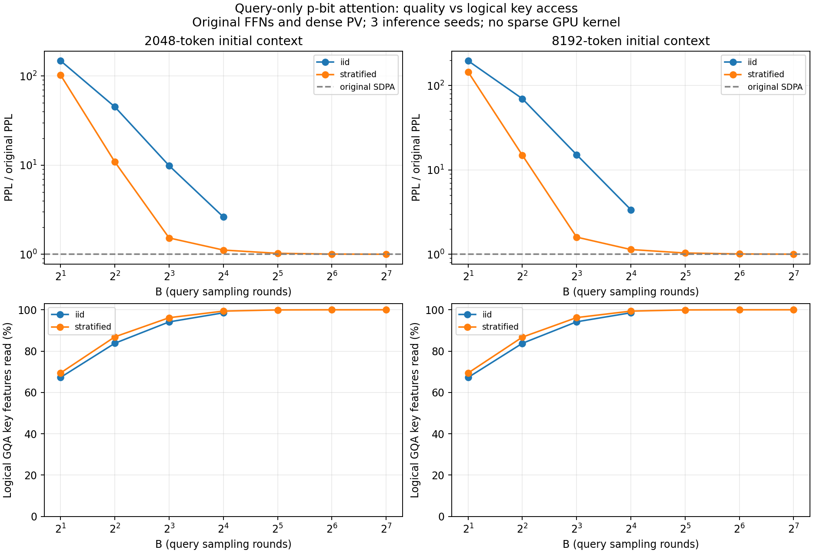

# Query侧p-bit编码：QK注意力实验（2026-10-06）

## 实现与范围

Qwen2.5-0.5B Base，24层全部替换decode-time QK。原始FFN、连续PV、Q/K/V投影、RoPE及精确prefill保留；无训练。
在RoPE之后，对每头q取a=max(abs(q))；每维生成b~Bernoulli(abs(q)/a)，保留sign(q)。
B轮读出为q_hat=sign(q)*a*count/B，再计算q_hat @ K^T / sqrt(d)，经过原始Softmax和连续PV。
K与V保持连续。未实现组平均query补偿，也没有叠加随机PV或FFN。全零query编码为零。

- `iid`：count~Binomial(B,p)，与B轮独立p-bit计数同分布。
- `stratified`：将[0,1)分为B个区间，各区间独立取一点并与p比较；计数精确等价于floor(Bp)+Bernoulli(frac(Bp))。
- 这里压缩的是计数的概率分布，不模拟B轮器件的实际耗时。当前GPU仍执行密集浮点矩阵乘法。

## 协议与验证

2k：32个互不重叠WT2 test片段，精确prefix2047后128步缓存teacher-forcing，共4096个计分token。
8k：16段，精确prefix8191后128步，共2048个计分token。当前随机网络产生的KV缓存持续参与后续步。
每个随机配置3个推理seed；±为总体标准差，不是跨文本置信区间。2k和8k只在各自基线内比较。
首批52项：两上下文、两种编码、B=2/4/8/16、三seed，加四个密集基线。
看到小B性能明显下降后，追加分层B=32/64/128三seed共18项；全部共70项。此追加由测试结果驱动，不是新独立测试集。
本轮不是完整WT2滑窗PPL，也未测试长时间自由生成及任务准确率；不能与历史完整WT2的11.652735直接比较。
60000次概率测试验证均值、解析方差、字面采样计数分布、零query和边界；缓存集成测试验证精确prefill、SDPA委托、随机种子复现和FFN对象保留。
70份结果的源码哈希、FFN/文本哈希和计分位置已核对。两个密集基线逐值复现先前PV实验，便于横向比较。

## PPL与逻辑Key特征访问

### 起始上下文2048

原始SDPA：10.373559；手写FP32密集参考：10.376637。

| 编码 | B | PPL均值 ± 标准差 | PPL增加 | 单头Key访问 | GQA组Key访问 | 加减事件/原始MAC项数 |
| --- | ---: | ---: | ---: | ---: | ---: | ---: |
| iid | 2 | 1533.792270 ± 99.559013 | 14685.59% | 19.220% | 67.28976% | 0.235 |
| iid | 4 | 466.614865 ± 6.055069 | 4398.12% | 30.101% | 83.81024% | 0.466 |
| iid | 8 | 102.258386 ± 2.204858 | 885.76% | 43.995% | 94.13941% | 0.925 |
| iid | 16 | 27.205009 ± 0.475369 | 162.25% | 58.836% | 98.53732% | 1.826 |
| stratified | 2 | 1060.596895 ± 30.798359 | 10124.04% | 21.027% | 69.45489% | 0.234 |
| stratified | 4 | 112.637641 ± 0.544938 | 985.81% | 35.478% | 86.91026% | 0.463 |
| stratified | 8 | 15.821101 ± 0.251467 | 52.51% | 52.508% | 96.16688% | 0.906 |
| stratified | 16 | 11.572424 ± 0.078649 | 11.56% | 68.867% | 99.36521% | 1.799 |
| stratified | 32 | 10.634896 ± 0.032451 | 2.52% | 81.478% | 99.93364% | 3.594 |
| stratified | 64 | 10.434807 ± 0.005026 | 0.59% | 89.697% | 99.99615% | 7.185 |
| stratified | 128 | 10.383784 ± 0.005816 | 0.10% | 94.515% | 99.99992% | 14.368 |

### 起始上下文8192

原始SDPA：9.418982；手写FP32密集参考：9.423515。

| 编码 | B | PPL均值 ± 标准差 | PPL增加 | 单头Key访问 | GQA组Key访问 | 加减事件/原始MAC项数 |
| --- | ---: | ---: | ---: | ---: | ---: | ---: |
| iid | 2 | 1853.627425 ± 101.958010 | 19579.70% | 19.309% | 67.24200% | 0.236 |
| iid | 4 | 658.330495 ± 44.799320 | 6889.40% | 30.262% | 83.77127% | 0.469 |
| iid | 8 | 142.907142 ± 2.056032 | 1417.22% | 44.321% | 94.18746% | 0.935 |
| iid | 16 | 31.805931 ± 0.706545 | 237.68% | 59.233% | 98.56371% | 1.850 |
| stratified | 2 | 1371.011823 ± 37.396595 | 14455.84% | 21.151% | 69.39520% | 0.235 |
| stratified | 4 | 140.860846 ± 5.593030 | 1395.50% | 35.560% | 86.76181% | 0.465 |
| stratified | 8 | 15.054803 ± 0.215089 | 59.83% | 52.934% | 96.22117% | 0.916 |
| stratified | 16 | 10.722650 ± 0.172560 | 13.84% | 69.228% | 99.36126% | 1.823 |
| stratified | 32 | 9.755195 ± 0.067715 | 3.57% | 81.688% | 99.92895% | 3.642 |
| stratified | 64 | 9.509737 ± 0.036782 | 0.96% | 89.795% | 99.99532% | 7.280 |
| stratified | 128 | 9.446416 ± 0.010016 | 0.29% | 94.559% | 99.99986% | 14.559 |

## 如何解读

分层采样明显改善精度，但足够准确时GQA组特征并集接近全量，Key读取收益很小。
Qwen每组7个查询头共享Key，每头有64个特征；访问比例按所有B轮和组内7头取并集。
加减事件比例按字面执行B轮符号位乘Key计数，不等于速度比：加法和乘加成本不同，合并计数也会改变实现。
所有访问比例是逻辑特征数，不是实际DRAM事务或实测加速。当前实现仍密集访问Key，并为诊断额外计算精确QK。
分数相对L2、Softmax分布KL/TV在同一当前Q/K状态下比较，详见comparison.json；不是与另一条精确模型轨迹作逐层比较。
线性QK估计无偏不保证Softmax概率无偏；本实验支持分数噪声改变注意力分布，但不定位具体敏感层或唯一因果机制。
本轮未实现论文组共享补偿方案，也未模拟真实p-bit驱动、器件相关性、寻址和能耗。不能将这些结果解释为硬件不可行或其他编码都无效。

源码：[experiments/pbit_qk](../../experiments/pbit_qk/README.md)。原始结果在evaluation/，运行命令在commands/。
