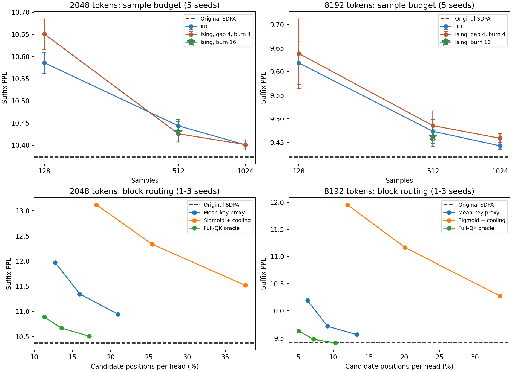

# Ising SoftMax与BoltzFormer式筛选：Qwen实验结果（2026-10-06）

完成140项评估：首轮70项、随机种子复测60项、保守预热确认10项。全部已结束。
Qwen2.5-0.5B Base全部24层仅替换decode注意力；保留原始FFN、投影、RoPE及精确prefill；无训练。
2k/8k分别计分4096/2048个WT2后缀token，位置与历史注意力实验相同。不是完整WT2 PPL；不同上下文不能横向比较。

## 1. 连接与实现范围

L类softmax用L-1个0/1 p-bit：全零代表参考类别，单个1代表其余类别。每位逻辑连接度L-2，无向连接(L-1)(L-2)/2。
| 类别数L | p-bit数 | 每位连接度 | 无向连接数 |
| ---: | ---: | ---: | ---: |
| 64 | 63 | 62 | 1953 |
| 2048 | 2047 | 2046 | 2094081 |
| 8192 | 8191 | 8190 | 33542145 |

这些连接是统一互斥系数，不是需要学习的任意J。可研究共享总激活数反馈，但物理广播、延迟、负载与稳定性仍需设计；不能把逻辑全连接直接当作零成本。
能量采用 E=-sum_i(z_i-z_ref)b_i + lambda*sum_(i<j)b_i*b_j；参考取最大logit。相对场非正，避免差参考引起过慢离开激活态。
**大模型实验是强惩罚极限下的理想异步连续时间热浴动力学，不是有限交叉阵列电路复现。** 从全零出生速率a_i=sigmoid(z_i-z_ref)，从激活i返回全零速率1-a_i。
程序批量生成交替的指数驻留时间并在等时刻观测，保持正确驻留加权与时间相关性；没有偷偷用softmax概率直接生成Ising输出。转移事件计数不能代替等时采样。
时间单位是每个p-bit单位速率时钟的倒数，不能换算成32微秒或直接视作GPU时间。固定目标beta=1预热，不做优化式降温退火。

## 2. 采样次数与PPL

下表重点配置采用5个推理seed，±为seed总体标准差，非数据集置信区间。
| 方法 | 样本数 | 间隔 | 预热 | 2k PPL | 8k PPL |
| --- | ---: | ---: | ---: | ---: | ---: |
| 原始SDPA | — | — | — | 10.37356 ± 0.00000 | 9.41898 ± 0.00000 |
| 手写同精度密集参考 | — | — | — | 10.37664 ± 0.00000 | 9.42351 ± 0.00000 |
| iid | 128 | 独立 | — | 10.58615 ± 0.02390 | 9.61825 ± 0.04487 |
| ising | 128 | 4.0 | 4.0 | 10.65111 ± 0.03429 | 9.63842 ± 0.07369 |
| iid | 512 | 独立 | — | 10.44374 ± 0.01391 | 9.47325 ± 0.02555 |
| ising | 512 | 1.0 | 4.0 | 10.48856 ± 0.03082 | 9.52783 ± 0.03606 |
| ising | 512 | 4.0 | 4.0 | 10.42577 ± 0.01577 | 9.48535 ± 0.03151 |
| ising | 512 | 4.0 | 16.0 | 10.43017 ± 0.02268 | 9.46223 ± 0.02126 |
| iid | 1024 | 独立 | — | 10.40082 ± 0.01153 | 9.44257 ± 0.00766 |
| ising | 1024 | 4.0 | 4.0 | 10.40136 ± 0.00754 | 9.45857 ± 0.00972 |

**建议起点：预热16、读取间隔4、采样512次。** 这是当前理想动力学与本评测上的推荐，不是物理时钟保证。
512次在两种上下文下已接近基线；1024次一般继续降低采样误差，但小差异受种子和有限文本影响，不能把不同设置的轻微反向波动解释为机制优势。
Ising512/gap4与已有IID512总体接近，支持它作为softmax类别样本发生器；仍需完整QK，主要替换softmax与后续类别采样。
原始软件为数值softmax->IID样本；Ising路径为QK->相对场->互斥动力学->样本->V平均。诊断代码仍额外计算精确softmax，但它不驱动Ising采样器。

## 3. 平衡与独立性验证

有限惩罚：6类、16000副本、600轮逐位随机扫描，对lambda=0/4/8/16/24分别与全状态枚举比较，TV均<0.025；有效状态条件分布与softmax在浮点误差内一致。
压缩连续时间模拟：100000副本，与精确生成矩阵指数的多个瞬态分布比较，逐元素误差<0.006；增量块缓存跨边界误差<1e-6。
6类诊断中512次读数的方差等效独立样本数：间隔0.25约67，间隔1约244，间隔4约491；不能把它当作所有Qwen行通用ESS。
额外提取原始Qwen的20条真实分数（2k/8k、5层、各2个文本位置），直接计算理想生成矩阵的瞬态分布：
| 预热时标 | 平均TV | 最大TV |
| ---: | ---: | ---: |
| 0 | 0.76160046 | 0.95103413 |
| 0.5 | 0.10496513 | 0.23225215 |
| 1 | 0.044478868 | 0.10372995 |
| 4 | 0.0029697851 | 0.0079651406 |
| 8 | 0.00020271713 | 0.00074715672 |
| 16 | 1.5099877e-06 | 8.6296923e-06 |

选择最大logit为全零参考时，这20条分数在lambda24下的无效稳态质量上界最大为3.49e-10。
lambda32、4100时标内的硬约束/有限惩罚路径分离概率上界最大为1.01e-09。
这些上界来自理想相同热浴速率与输入场的数学比较，不覆盖器件漂移、耦合误差、传播延迟；20条分数不是全部模型状态的保证。

## 4. BoltzFormer式候选筛选

**这是免训练的Qwen适配，不是图像论文中已训练MLP置信度模型的复现。** 每64个Key组成一块，缓存每块均值/坐标方差；首个decode建立摘要，之后只更新新Key。
block_mean：q与块均值点积，加log块大小估计质量；block_moment额外加入对角高斯方差修正。block_paper用sigmoid置信度及tau=1/(layer+1)。
Bernoulli候选包含率=1-(1-p_block)^K；K=ceil(预算比例*块数)。强制保留首块和最后两块。预算比例不是最终保留比例，重复抽取及强制块都会影响它。
选中块内部仍做精确softmax注意力。oracle使用完整QK的真实块质量，不能节省QK，只是筛选器诊断；oracle_topk为确定性相关性对照，不是端到端质量的严格上界。
| 上下文 | 方法 | 预算比 | seed数 | PPL | 实际候选位置/头 | GQA组地址并集约 |
| ---: | --- | ---: | ---: | ---: | ---: | ---: |
| 2048 | block_mean / d64 | 0.25 | 3 | 11.34710 ± 0.06115 | 15.94% | 43.3% |
| 2048 | block_mean / d64 | 0.5 | 3 | 10.94290 ± 0.04148 | 20.97% | 55.6% |
| 2048 | block_paper / d64 | 0.5 | 1 | 11.51649 ± 0.00000 | 37.65% | 87.3% |
| 2048 | oracle / d64 | 0.25 | 3 | 10.66822 ± 0.04371 | 13.58% | 35.5% |
| 2048 | oracle_topk / d64 | 0.25 | 1 | 10.42695 ± 0.00000 | 26.93% | 52.0% |
| 2048 | block_mean / d16 | 0.25 | 1 | 12.43374 ± 0.00000 | 18.42% | 46.2% |
| 8192 | block_mean / d64 | 0.25 | 3 | 9.71608 ± 0.01359 | 9.15% | 31.5% |
| 8192 | block_mean / d64 | 0.5 | 3 | 9.55960 ± 0.00430 | 13.33% | 42.6% |
| 8192 | block_paper / d64 | 0.5 | 1 | 10.27360 ± 0.00000 | 33.54% | 85.6% |
| 8192 | oracle / d64 | 0.25 | 3 | 9.47404 ± 0.01594 | 7.17% | 25.4% |
| 8192 | oracle_topk / d64 | 0.25 | 1 | 9.36914 ± 0.00000 | 25.39% | 50.8% |
| 8192 | block_mean / d16 | 0.25 | 1 | 11.51043 ± 0.00000 | 11.86% | 37.5% |

8k下均值摘要的预算0.5配置实际保留约13.33%位置，三seed PPL约9.560，比原始9.419增加约1.49%；2k下同配置约10.943，增加约5.49%。
GQA组并集在8k约42.6%，不能把单头13.3%解释为整个KV缓存只读13.3%。实际物理访存和QK跳过仍需稀疏实现。
统计细节：在线地址并集按非零FP32权重计算，极少数候选权重下溢为零；summary.csv由选中块数量重建精确单头候选比例，并给出组并集上下界，避免把下溢当成物理跳读。
真实块质量oracle在更少候选下通常更好，说明廉价置信度仍有改进空间；均值/方差和固定16维子采样不足以稳定预测重要块。
照搬sigmoid及逐层降温也未改善当前免训练版本；不能据此否定原文的已训练图像模型。下一步可蒸馏训练块选择器，比较多代表Key与GQA共享预算。

## 5. 成本、局限与文件

Ising仍计算完整QK；通过类别样本可把PV转为选择加法，但本次采用密集count/M @ V作数值参考。
筛选器由缓存摘要驱动，理论上可在选块后才计算精确QK；当前程序为诊断仍计算完整QK及密集masked PV，**实测GPU代码未加速，不能宣称已节省实际带宽或能耗**。
原始SDPA单次decode约3秒/6秒；这些参考实现约7-20秒，具体记录见JSON。并行任务会影响墙钟，不能作为公平内核性能基准。
140项源码SHA256、原始FFN哈希、文本哈希、目标位置均核验通过。只测试生成阶段，尚未测试随机prefill、FFN联合替换、真实电路或训练后的选择器。
测试集已用于探索与选择配置；正式报告泛化结论前应冻结配置并补充独立数据。

- `summary.csv` / `summary.json`：所有配置均值、seed标准差、候选和访问统计。
- `evaluation/`：140份逐次结果、逐样本NLL及哈希。
- `diagnostics.json`：有限惩罚、瞬态、样本相关性、摘要缓存测试。
- `real_logit_transients.json`：真实Qwen分数上的精确瞬态检查。
- `audit.json`：结果完整性核验。
- `protocol.json`、`repeat_protocol.json`、`burn_protocol.json`：三阶段实验清单。

