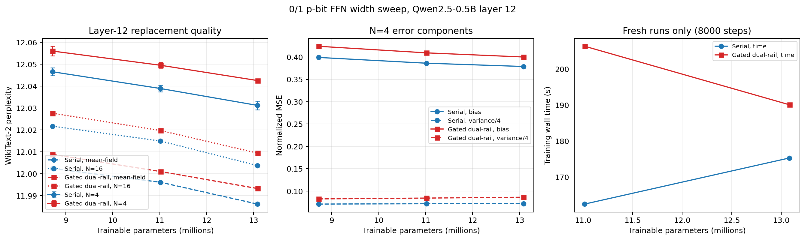

# 第12层宽度实验：更正后的最终结果

## 先前结果的更正

此前新增宽度的评估误用了 `student_step6000.pt`。训练脚本按总步数命名，
所以它实际包含2000步预热和4000步随机训练；而复用的小宽度检查点已完成
6000步随机训练。此前“门控加宽变差”和“普通只改善0.0027”的结论撤回。

现已重新评估四个新增宽度的 `student_sampled.pt`，并读取全部六个checkpoint
的元数据，确认 phase 为 full_path_sample_aware、phase step=6000。
没有重新训练或根据test分数挑选checkpoint。旧评估保存在
`superseded_global_step6000/`，更正结果也保存在 `corrected_final/`。
本目录的 comparison、evaluation、moments、manifest 与图表现已更新为更正版本。

## 结果

只替换Qwen2.5-0.5B Base的layer12；0/1传播、矩阵偏置、可学习标量温度，
2000步预热+6000步N=4随机训练，batch4、sequence256。
完整WikiText-2 test每次计分299077个token。N=4用三个推理seed；
mean-field和N=16各用一个seed。±为推理seed的总体标准差，不是训练置信区间。

| 结构 | 宽度 | 参数M | Mean-field | N=4 PPL | N=16 |
| --- | ---: | ---: | ---: | ---: | ---: |
| 普通串联 | 4864 | 8.722 | 12.002341 | 12.046547 ± 0.001808 | 12.021689 |
| 普通串联 | 6144 | 11.017 | 11.996088 | 12.038905 ± 0.001502 | 12.014932 |
| 普通串联 | 7296 | 13.083 | 11.986131 | 12.031194 ± 0.002027 | 12.003711 |
| 门控双轨 | 3242 | 8.722 | 12.008790 | 12.056005 ± 0.002190 | 12.027609 |
| 门控双轨 | 4096 | 11.019 | 12.000984 | 12.049526 ± 0.001350 | 12.019709 |
| 门控双轨 | 4864 | 13.085 | 11.993221 | 12.042546 ± 0.000594 | 12.009398 |

普通增加约50%参数，PPL改善0.015354；门控改善0.013459。加宽对两者均有帮助，
同参数预算下普通仍领先。相对原Qwen的PPL 11.652735，最大普通模型为12.031194，
仍高约3.24%。本轮只支持“此训练条件下加宽收益有限”，不能断言容量无关、
门控必然无效或已达到表达能力上限。最小宽度为恢复训练、其他宽度为连续训练，
随机流并非逐位一致；训练seed仅一个。

## 固定输入矩诊断

每组使用相同1024个teacher输入token、每输入256条路径。
bias为有限采样修正后的平方偏差；预测N=4 NMSE=bias+单路径variance/4。

| 结构 | 宽度 | bias NMSE | 单路径variance NMSE | N=4预测NMSE |
| --- | ---: | ---: | ---: | ---: |
| 普通串联 | 4864 | 0.399067 | 0.283158 | 0.469856 |
| 普通串联 | 6144 | 0.386186 | 0.286174 | 0.457730 |
| 普通串联 | 7296 | 0.378819 | 0.287426 | 0.450676 |
| 门控双轨 | 3242 | 0.424058 | 0.329257 | 0.506372 |
| 门控双轨 | 4096 | 0.409339 | 0.336759 | 0.493528 |
| 门控双轨 | 4864 | 0.400082 | 0.344272 | 0.486150 |

普通bias由0.399067降至0.378819（约5.07%），门控由0.424058降至0.400082
（约5.65%）。单路径方差分别略升约1.51%和4.56%。主要局部误差仍来自平均映射
与目标的差距；但训练、输入编码和有限采样目标都可能贡献该差距，不能直接称作
网络不可避免的结构误差。该局部NMSE占比也不能解释为PPL误差占比。

## 成本与复现

四个新模型的完整8000步训练耗时162.50–206.31秒，峰值allocated memory约
1.31–1.53GiB；PPL评估约5GiB。小宽度summary仅计6000步续训，因此不把它的
耗时与新模型的8000步耗时直接做比值。并行环境影响wall time，非硬件能耗测量。

修正入口：`experiments/pdnn_ffn/correct_width_sweep_evaluation.py`。
正常扫描与恢复脚本也已改为新宽度选择 `student_sampled.pt`。
`manifest.json`包含检查点SHA-256与已核验的phase step。
大型权重继续保存在服务器，已有原始训练日志和summary保留。

下一步优先进行保留teacher投影的幅值编码与SwiGLU乘积结构消融，比较连续值、
概率期望和实际N=4采样，区分函数拟合误差、入口噪声与训练梯度问题。
